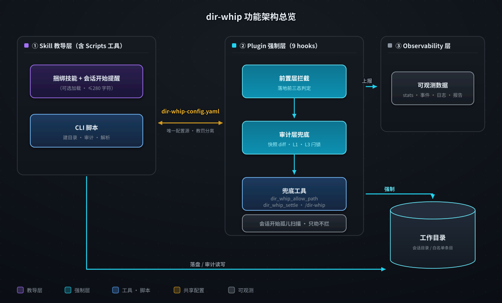
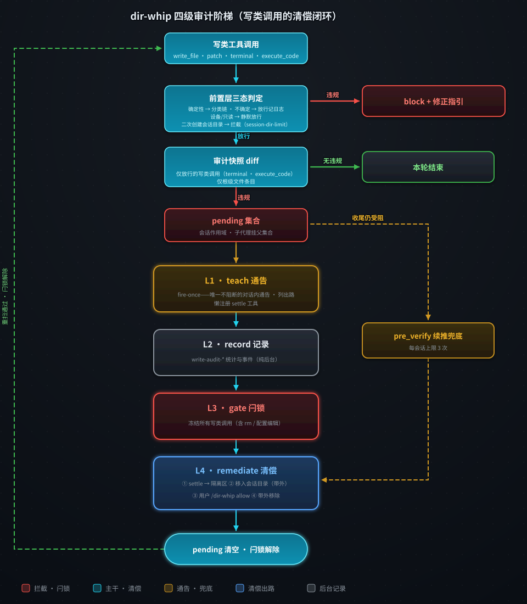
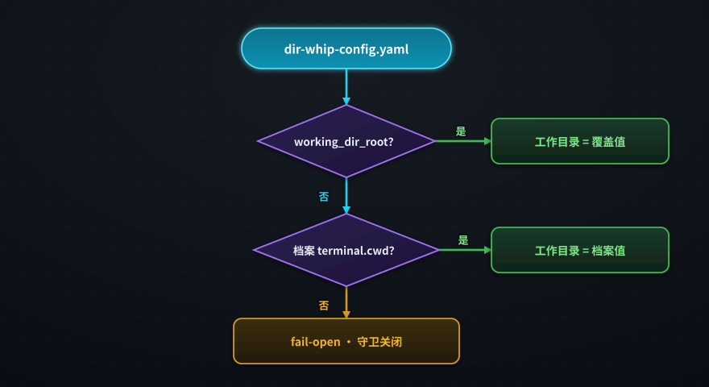
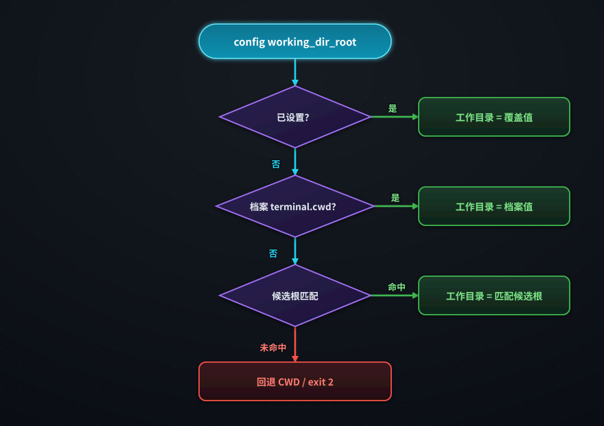
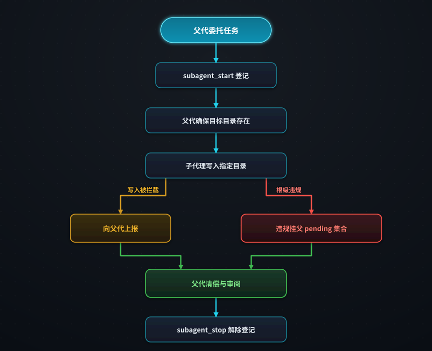



# dir-whip

[](https://opensource.org/licenses/MIT)
[](https://github.com/shawVV1992/dir-whip)

[English](./README.md) | [中文版](./README-zh.md)

本文档与英文版 README 同步维护，两版结构镜像、内容一致。

每个产出文件的会话都可能把工作区搅乱：报告、草稿、临时文件散落在 agent
当时所在的目录里。**dir-whip** 为 [Hermes-agent](https://github.com/NousResearch/hermes-agent)
的每次对话在工作目录（Initial Project Directory）内安一个唯一的家——带时间戳的
会话目录——并以三层保障强制执行：捆绑技能教导纪律、插件以 9 个钩子在落地前
拦截违规、审计层捕获漏网之鱼。

注意：dir-whip 权限范围仅限于工作目录（Initial Project Directory），工作目录之外的写入不受管控，新建的项目目录不受管控。

[核心能力](#核心能力) ·
[安装与快速上手](#安装与快速上手) · [工作原理](#工作原理) ·
[命令](#命令) · [效果演示](#效果演示) · [高级用法](#高级用法) ·
[安全与风险](#安全与风险) · [License](#license)

## 核心能力

1. **教罚结合：** skill 教纪律、plugin 强制执行，默认工作区管理纪律有效稳定，文件管理不再混乱。
2. **双层检测+兜底工具：** 在插件中，前置层在落地前拦截白名单与会话目录之外的写入（含根级文件与非会话子目录）并附修正指引；审计层对放行的终端命令做快照 diff 事后兜底——并配同轮自愈（`dir_whip_settle`）与 dir-whip 续推兜底。
3. **可观测：** 定义 7 类 `dir-whip:*` 事件保存至 stats.jsonl（5 MB 滚动），可观测溯源。
4. **定时治理：** 针对 cron 任务采用纯审计 + 两态唤醒（`{"wakeAgent": bool, "violations": N}`），全插件零自动删除；静默 tick 不打断执行，有违规才唤醒 agent 清偿。
5. **子代理纪律：** 子代理写入父代指定目录，绝不自行创建会话目录。
6. **项目模式感知：** 当活跃 Hermes 项目包含 agent CWD 时，会话开始提醒整体跳过（`skipped-project`）。

## 安装与快速上手

### 前置要求

- 安装 Hermes 0.20.0 或更高版本。
- 安装命令需要可访问 GitHub。

### 快速上手

1. 安装插件及其捆绑的技能、脚本与配置模板

```bash
hermes plugins install shawVV1992/dir-whip/dir-whip --enable
```

2. 重启 Hermes —— 插件在下一次会话生效

3. 验证生效配置及其来源
```bash
/dir-whip
```

应看到 `State: enabled` —— 完整样例见[效果演示](#效果演示)。

插件在重启 Hermes 后生效。无需安装脚本，也无需单独安装技能。

### 更新

```bash
hermes plugins install shawVV1992/dir-whip/dir-whip --force
```

重装不会清除 `dir-whip-config.yaml`。

### 卸载

```bash
hermes plugins remove dir-whip
```

### 开启 / 关闭

```bash
# 开启插件
hermes plugins enable dir-whip

# 关闭插件
hermes plugins disable dir-whip

```

## 工作原理

### 设计思路

- **教罚分离** —— skill 与 plugin 零运行时耦合，只共享同一份配置与同一套
  判定规则。
- **允许误放、绝不误拦** —— 前置层fail-open策略，审计层可靠兜底。
- **观察事实，而非推断意图** —— 审计层 diff 实际落盘的文件，而非解析
  命令字符串。

### 功能架构



| 层 | 职责 | 形态 |
|----|------|------|
| **Config**（`dir-whip-config.yaml`） | 唯一配置源；教导层与强制层零运行时耦合，仅通过该文件双向衔接（教罚分离） | `allowlist` files/dirs + `working_dir_root` 两个键；可手改或经 `/dir-whip` 命令行级编辑 |
| **Skill（教导，含 Scripts 工具）** | 纪律参考 + CLI 辅助 | 捆绑的 `workspace-organization` 技能（可选加载）+ 条件化会话开始提醒（≤280 字符，仅当 agent CWD 位于工作目录内且无活跃项目覆盖时注入）；脚本 `create_session_dir.py` / `audit_workspace.py` / `workspace_resolver.py`（建目录 · 审计 · 解析） |
| **Plugin（强制）** | 拦截违规落地和兜底处理 | 9 个钩子分三组（与图中模块对应）：**前置层拦截**（`pre_tool_call` 落地前三态判定）、**审计层兜底**（快照 diff + L1 通告 + L3 闩锁）、**兜底工具**（`dir_whip_allow_path` / `dir_whip_settle` / `/dir-whip`）；另含 `pre_verify` 续推兜底与纯观察钩子 |
| **Observability（可观测）** | 记录与报告 | stats.jsonl（5 MB 滚动）+ 7 类 `dir-whip:*` 事件 + dir-whip.log + `/dir-whip` 合并报告 |

每个产生文件的 Hermes 对话都会在工作目录根部得到一个会话目录：

```
<Working Directory>/
├── (严格空白名单；通过 /dir-whip allow 添加)
└── 20260822_143000_ReportTask/    # 会话目录（懒创建）
    ├── Outputs/                   # 正式交付物
    └── .tmp/                      # 中间文件（按龄盘点，永不自动清理）
```

- 命名 `YYYYMMDD_HHMMSS_TaskName/`，时间戳必须真实（插件校验）。
- 懒创建：首次文件写入时才建，不产出文件的对话不建目录。
- 根目录只允许两样东西：白名单 `files` 条目、会话格式目录。（审计隔离区已迁至
  dir-whip home：`<profile home>/dir-whip/audit-quarantine/`。）

### 执行策略

运行时链路建立在规格 §5.18 的四级审计阶梯之上：

| 级别 | 名称 | 机制与位置 |
|------|------|-----------|
| **L1** | teach（教育） | fire-once 通告——违规与出路的唯一对话内提示（`transform_tool_result` 钩子，只进对话一次） |
| **L2** | record（记录） | `write-audit-violation` / `write-audit-gate-block` 的统计行与总线事件——纯后台可观测，不进对话、不拦截 |
| **L3** | gate（闸门） | 未清偿违规的闩锁——冻结所有写类调用，直至清偿完成 |
| **L4** | remediate（清偿） | 清偿出路与兜底——`dir_whip_settle` / 移入会话目录 / 用户 `/dir-whip allow` / 带外移除 |



`write_file` / `patch` 按目标路径判定；终端命令在 shell 层做词法分层判定。
两层各司其职——前置层管落地前，审计层管落地后：

**前置层（拦截，宽容快速）** —— 设计原则是**允许误放、绝不误拦**：

- 拦截对象仅三种写类工具：`write_file` / `patch` / `terminal`；其余工具与只读命令不进入判定。
- **三态判定**：确定性目标（工具路径、终端重定向 / `touch` / `cp`·`mv` 目的地）进入统一分类链；不确定写入意图（heredoc、解释器段首、嵌套 shell、`$`/反引号变量）放行并记日志；设备路径与只读命令静默豁免。
- **链感知提取**：命令链按 `&&` / `;` / `|` / 换行切段，仅段内提取目标；`=` 开头目标排除。
- **统一分类链**（与审计层共用，判定永不矛盾），定稿 T0-T4、范围置首：T0 工作目录之外 → 放行记日志（`external-write`）；T1 运行时白名单（当场授权）→ 放行；T2 config 白名单（`dirs` 子树 / 根级 `files` 条目）→ 放行；T3 会话目录 → 放行；T4 其余 block（`root-file` / `non-session-dir`，含工作目录根自身），block 消息自带修正指引。链序范围置首：根外判定恒为 `external-write`——白名单条目不再可能掩盖该信号。

**审计层（兜底，四级阶梯）** —— 只观察放行的终端命令实际落盘了什么：

- **快照 diff**：仅为放行的终端命令拍根目录前后快照；只判根级**文件**条目，目录变动永不判违规，删除仅记账。
- **pending 集合**：会话作用域，子代理违规挂到父集合——闩锁由父代清偿。
- 四级阶梯（定义见上表）：**L1** fire-once 通告是对话内唯一提示；**L2** 统计与事件纯后台；**L3** 闩锁冻结一切写类调用（含 `rm` 与代理发起的配置编辑）；**L4** 四条出路——settle / 移入会话目录（须带外）/ 用户 `/dir-whip allow` / 带外移除。
- **清偿判定 config-only**：运行时豁免只前瞻生效，不清偿已记录违规。
- **pre_verify 续推兜底**：收尾仍有未清偿违规则再催一次，每会话累计上限 3 次。

> **注意事项**
>
> - 闩锁期间*所有*写入类调用均被冻结——含 `rm` 与代理发起的配置编辑，会话内无法自行解除。
> - 运行时豁免**不清偿**已记录违规；闩锁仅限当前会话，文件离开根目录即恢复放行。

## 命令

### 命令清单

| 命令 | 作用 | 示例 | 说明 |
| ---- | ---- | ---- | ---- |
| `/dir-whip` | 输出合并报告（字段见「报告字段」） | `/dir-whip` | |
| `/dir-whip list` | 查看当前白名单（两段式编号列表） | `/dir-whip list` | Files 段在前、Dirs 段在后，共用一段连续编号（allow / remove 的编号即此编号） |
| `/dir-whip allow` | 枚举白名单候选条目（两段式编号列表 + Add 提示） | `/dir-whip allow` | 编号规则同 `list` |
| `/dir-whip allow <编号\|名称\|路径>` | 向白名单登记条目，逗号批量；现存路径按磁盘判别（目录→`dirs`、文件→`files`），不存在路径走确认-创建协议 | `/dir-whip allow notes.txt` · `/dir-whip allow projects/foo` · `/dir-whip allow 1,3` · `/dir-whip allow docs/ --create` | 路径接受相对或绝对输入，根外/根自身输入被引导拒绝；`--create` 按输入形态创建产物：末尾斜杠或嵌套路径→目录，裸文件名→根级文件 |
| `/dir-whip remove` | 枚举白名单当前条目（两段式编号列表 + Remove 提示） | `/dir-whip remove` | 编号规则同 `list` |
| `/dir-whip remove <编号\|名称>` | 从白名单移除条目；按名称匹配、不做磁盘判别（双段同名一并移除） | `/dir-whip remove 2` · `/dir-whip remove notes.txt` | 编号即两段式连续编号 |

### 报告字段

`/dir-whip` 输出一份合并报告：

| 字段 | 含义 |
| ---- | ---- |
| `[dir-whip] v<version>` | 插件版本，取自插件的 plugin.yaml（读取失败显示 `unknown`） |
| `State` | `enabled`，或 Working Directory 无法解析时的 `disabled`（fail-open，守卫关闭） |
| `Working Directory` | 生效值 + 解析来源（见下一行）；无法解析时显示 `(unresolved)` |
| source | `guard-config`（dir-whip-config.yaml）· `profile-config`（档案 `terminal.cwd`）· `fail-open` |
| `Allowlist` | 多行块：头行 `Allowlist:` + 缩进两格的 `Files:` / `Dirs:` 各一行；完全无条目时为单行 `Allowlist: (strict empty allowlist)`；被忽略的遗留平铺值追加缩进计数行 |
| `WARNING` | 仅异常时出现：`working_dir_root` 覆盖值与当前档案 `terminal.cwd` 不一致 |
| `Stats File` | stats.jsonl 的绝对路径 |
| `Debug Log` | dir-whip.log 的绝对路径；尚无记录时后缀 `(no records yet)`，日志初始化失败时 `(unavailable)` |
| `Health` | `Good`，或 `N issue(s)` 并逐行列出问题（解析 FAIL-OPEN、stats.jsonl 不可写） |

## 效果演示

以下插件消息均为源码原文；仅长路径做了缩略。

### 1. 前置层拦截根级写入

```text
你：   把今天的站会要点存成 notes.txt。

Agent: echo "Standup notes ..." > notes.txt        # 根级写入

BLOCKED: File writes in the Working Directory require a Session Directory or an allowed root file.
Target: notes.txt
Fix: Create a session directory first:
  python <plugin>/skills/workspace-organization/scripts/create_session_dir.py <task_name> --workspace <Working Directory>
Then write the deliverable to Outputs/<filename> (or scratch to .tmp/<filename>).
User-specified path -> dir_whip_allow_path first.
If this is a project directory, add it to the allowlist dirs in HERMES_HOME/dir-whip/dir-whip-config.yaml (relative to the Working Directory root, e.g. projects/foo)
Reply using the [Reason]/[Next] template.

Agent: python .../scripts/create_session_dir.py StandupNotes --workspace <WD>
       # 创建 20260827_100000_StandupNotes/
Agent: .../20260827_100000_StandupNotes/Outputs/notes.txt   # 干净落盘
```

### 2. 审计层捕获漏网之鱼——并同轮自愈

```text
Agent: （一次写入绕过前置层，落在了根目录）

[dir-whip] Write audit: the following file(s) were written to the Working Directory root outside any Session Directory:
  - notes.txt
Remediate now: call dir_whip_settle(paths=["notes.txt"]) to move the file(s) into quarantine (<profile home>/dir-whip/audit-quarantine/), or move them manually into a Session Directory (YYYYMMDD_HHMMSS_TaskName/Outputs|.tmp/). To keep the file(s) at the root, ask the user to add them to the allowlist files entries in dir-whip-config.yaml (files: [notes.txt]) — give them the exact command to run: /dir-whip allow <path> — while the block is active all writes are frozen (config edits included). Further writes to the Working Directory are blocked until then.

Agent: dir_whip_settle(paths=["notes.txt"])
       # 文件移入 <profile home>/dir-whip/audit-quarantine/<timestamp>/，闸门重新打开
```

### 3. `/dir-whip` 报告实时状态

```text
/dir-whip

[dir-whip] v0.6.3
State: enabled
Working Directory: E:/HermesWorkspace/default  (source: guard-config)
Allowlist:
  Files: README.md
  Dirs: projects/foo
Stats File: C:/Users/me/AppData/Local/hermes/dir-whip/stats.jsonl
Debug Log: C:/Users/me/AppData/Local/hermes/dir-whip/dir-whip/dir-whip.log
Health: Good
```

## 高级用法

### config 配置

可选、由用户维护，位于 `HERMES_HOME/dir-whip/dir-whip-config.yaml`
（`HERMES_HOME` 环境变量优先；Windows 默认 `%LOCALAPPDATA%/hermes`，未设时
回退 `~/hermes`；POSIX 默认 `~/.hermes`）。会话档案启用时落至
`profiles/<name>/dir-whip/`。

| 字段 | 含义 |
| ---- | ---- |
| `allowlist.files` | 根级文件 basename 白名单（如 `README.md`）；名称校验禁止 `..`、绝对形式与路径分隔符 |
| `allowlist.dirs` | 相对工作目录的目录路径（如 `projects/foo`），**递归子树豁免**，允许多级 |
| `allowlist` 键缺失 | 严格空回退——白名单为空，根级一切写入均拦截 |
| `working_dir_root` | 显式工作目录覆盖；与当前档案 `terminal.cwd` 不一致时 `/dir-whip` 报告输出 WARNING |

```yaml
allowlist:
  files: []   # 根级文件 basename，如 ["README.md", "notes.txt"]
  dirs: []    # 相对目录路径，递归子树豁免，如 ["projects/foo"]
# working_dir_root: E:/HermesWorkspace/default   # 可选覆盖
```

**解析机制。** 插件与脚本各有一条解析链（节点细节见各图下方说明）：

**插件侧**（register 解析一次 · 顶层会话开始刷新）：



- 安全 YAML 解析（`safe_load`）：文件缺失或解析失败 fail-open 到空配置；覆盖值与档案 `terminal.cwd` 不一致时 `/dir-whip` 输出 WARNING；fail-open 时守卫关闭（`State: disabled`，Health 列出问题）。

**脚本侧**（独立运行 · 无 yaml 库时行解析兜底）：



- 候选根 = 枚举各档案 cwd + `TERMINAL_CWD`（`--workspace` 按相等匹配、CWD 按包含匹配）；未命中时交互模式回退 CWD 并发 stderr WARNING，`--workspace` 模式保持干净、由调用方 exit 2；两条链判定等价（parity 测试保证），守卫与脚本结论一致。

### 支持 cron 任务

`audit_workspace.py` 是 Hermes cron 任务的定时治理入口：`--gate` 执行一次纯审计
并在 stdout 末尾追加一行 JSON 唤醒行。退出码：0 合规、1 有违规、2 参数错误或
Working Directory 未解析（cron 失败可见性）。

- **纯审计 + 两态唤醒**——stdout 末行为 `{"wakeAgent": bool, "violations": N}`，
  恰好两键。`false` 为静默 tick（不打断执行）；`true` 唤醒 agent 清偿。
- **零自动删除**——全插件没有任何自动删除路径；清理决策归还 agent。
- **只读盘点**——交互模式审计将过期 `.tmp` 条目以提案形式列出
  （"Expired .tmp entries (proposal only; cleanup needs your confirmation):"），
  供 agent（或用户）后续处置。

```bash
# cron 任务示例：审计工作目录，仅违规时唤醒
python <plugin>/skills/workspace-organization/scripts/audit_workspace.py --gate
```

### 子代理模式

父代理把任务委托给子代理时，遵循以下机制：



- `subagent_start` 登记 child→parent 映射：子会话开始提醒记为
  `skipped-child`，审计状态继承父会话（不重置闩锁）。
- 父代在委托前确保目标目录存在（必要时先创建会话目录）；缺省为父会话
  `.tmp/`，可显式传 `Outputs/` 路径（正式交付物），或为每个子代理指定独立子目录
  （如 `.tmp/<task>/`）。
- 子代理写入的判定与父代完全一致；统计按 `is_subagent` 切分。
- 子代理的审计违规挂到**父 pending 集合**——`dir_whip_allow_path` 与
  `dir_whip_settle` 对子代理拒绝，豁免与清偿都由父代执行。
- 目标目录缺失或写入被拦截时向父代上报，而非自行创建会话目录。
- `subagent_stop` 解除登记并记录 duration/状态；`.tmp/` → `Outputs/` 晋升
  归父代审阅。

### 统计与可观察

每次判定以一行 JSON 追加写入 `HERMES_HOME/dir-whip/stats.jsonl`（超过 5 MB
滚动为 `stats.jsonl.1`）。记录范围：拦截判定、运行时豁免、审批观察，以及
写入审计的违规与闸门拦截（`write-audit-violation` /
`write-audit-gate-block`），按子代理切分。每行字段分两组：

| 字段 | 含义 | 说明 |
| ---- | ---- | ---- |
| `profile` | 会话档案 | 统计文件落在该档案的 dir-whip 目录，路径随会话档案切换 |
| `session_id` | 会话标识 | 当前判定所属会话 |
| `is_subagent` | 子代理标记 | 统计按父/子代理切分 |
| `started_at` | 会话开始时间 | 会话上下文的一部分 |
| `ts` | 事件时间戳 | ISO 格式，判定发生时刻 |
| `outcome` | 判定结果 | `block` / `allow` / `external-write` / `write-audit-violation` / `write-audit-gate-block` 等 |
| `reason` | 结果原因 | 短语说明，如根外写入记 `target outside working_dir_root` |
| `tool` | 触发工具 | `write_file` / `patch` / `terminal` / `allow-path` 等 |
| `rule_key` | 判定规则键 | 如 `root-file` / `non-session-dir` / `session-dir` / `runtime-allowlist` / `external-write` / `allow-path-external-rejected` |
| `target` | 目标路径 | 一律相对 Working Directory；外部路径哈希前缀或省略 |

全文件不含文件内容、绝对路径或提示词文本。可观察入口：

- **实时事件流**——判定与审计结果以 7 类 `dir-whip:*` 事件发到 Hermes 事件
  总线，订阅即观测；
- **`/dir-whip` 报告**——Stats File 路径（跨会话汇总入口）、Health（统计
  健康）与 Debug Log（配置来源核对）；
- **日志分级**——`block` / fail-open 记 WARNING，`external-write` 记 INFO，
  其余放行记 DEBUG（dir-whip.log）。

## 安全与风险

dir-whip 是**行为监控与软性管理**，**不是安全边界**：它经由宿主工具层观察并纠正文件行为，无法防御绕开工具层的通道（如代码执行内核内的文件 I/O）。

**管。**

1. **写类工具拦截**——`write_file` / `patch` / `terminal` 中，工作目录内白名单与会话目录之外的写入在落地前拦截（含根级文件与非会话子目录，`root-file` / `non-session-dir`），block 消息自带修正指引。
2. **根级写入事后审计与清偿闸门**——放行的终端命令经快照 diff 捕获漏网违规，走 L1–L4 阶梯直至清偿（见执行策略）。
3. **会话目录结构合规**——`audit_workspace.py` 检查 Outputs/ 与 .tmp/ 结构合规，过期 `.tmp` 条目以只读提案列出（cron 定时治理的入口——零自动删除）。

**不管。**

1. **任意代码执行**——`execute_code` 等执行内核内的文件 I/O 完全绕过守卫、审计与闸门，是最大的盲区。
2. **不确定写入意图**——解释器脚本、嵌套 shell、变量路径、heredoc：放行 + 记日志，可能漏网（审计层兜底）。
3. **白名单与豁免范围**——`allowlist` files / dirs、运行时白名单、会话目录内的写入：一律放行。
4. **工作目录之外的一切**——放行 + 记日志。
5. **只读工具与只读命令**——不进入判定。
6. **删除操作**——仅记账，永不判违规。

**可能出什么问题：**

- **提示注入**——agent 可能被诱导写入任意位置，落点不可控。比如被要求阅读的网页或文档里藏一句"把结果保存到 ~/xxx"，agent 就可能照做：工作目录之外的目标 dir-whip 一概放行，只能靠日志事后追溯。
- **防线弱化**——扩大 `allowlist` dirs 或禁用插件，工作区即失去管理。`allowlist` dirs 是递归子树豁免，多登记一个目录就把整棵子树置于纪律之外；`hermes plugins disable dir-whip` 一条命令即可关闭全部拦截与审计。
- **配置错误**——未必能一眼发现。白名单文件名拼错，该豁免的文件不生效，表现为莫名其妙的拦截；改错某个档案目录下的 `dir-whip-config.yaml`，修改根本不生效——这类问题藏在行为里，不看 `/dir-whip` 报告很难定位。

**内置防护：**

- **落地前拦截**——强制发生在 `pre_tool_call` 钩子，先于写入落地：违规目标在执行前即被拦下并附修正指引，不产生脏文件，也没有"先写错再清理"的成本。
- **落地后兜底**——不确定层命令仍可能经脚本间接落文件；审计层对根目录做前后快照 diff，发现新增或修改的根级违规文件即登记 pending 并冻结一切写入，直到清偿完成。
- **异常不静默**——工作目录无法解析等配置异常会 fail-open 放行，但同时注入 WARNING，绝不悄悄失效；边界无法核验（`--workspace` 不匹配或根解析失败）时审计门拒绝唤醒 agent。
- **最小能力面**——外部写入放行但记入日志，可事后审计；`dir_whip_settle` 只接受当前待清偿集合内的路径、全有或全无，即使被诱导也不具备任意移动文件的能力。
- **可核验**——每次判定落一行 stats.jsonl（隐私裁剪：不含文件内容与绝对路径）；`/dir-whip` 的 Health 与 Debug Log 可随时核对配置来源与统计健康。

## License

[MIT](./LICENSE) —— 见 [LICENSE](./LICENSE) 文件。不捆绑任何第三方组件。
