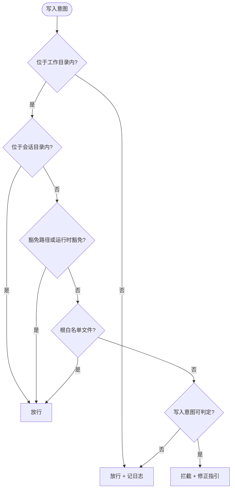

# dir-whip

[](https://opensource.org/licenses/MIT)
[](https://github.com/shawVV1992/dir-whip)

[English](./README.md) | [中文版](./README-zh.md)

本文档为英文 README 的中文翻译版本，如有歧义以英文版为准。

dir-whip 为 Hermes 智能体的工作目录（Working Directory）强制执行文件
纪律：内置的技能负责教导规则，插件负责在违规落地之前将其拦截。支持
Windows、Linux、WSL 与 macOS。

[安装与快速上手](#安装与快速上手) · [守护范围](#守护范围) · [命令](#命令) ·
[配置](#配置) ·
[高级用法](#高级用法) · [安全与风险](#安全与风险) ·
[贡献](#贡献) · [License](#license)

## 为什么选择它

- **双层一体** —— 技能负责教导、插件负责强制；1 条原生命令同时安装两者。
- **违规前拦截** —— 7 个钩子截获文件写入；指向根目录的违规写操作被拦截，
  并附修正指引。
- **零配置纪律** —— 默认注入常驻提示（≤500 字）；配置异常时 fail-open 并
  发出 WARNING。
- **支持定时治理** —— `audit_workspace.py --gate` 支撑零 token 的 cron 预检，
  采用 wakeAgent / [SILENT] 模式。
- **天生可观测** —— 1 个斜杠命令、5 个 `dir-whip:*` 事件，以及隐私
  裁剪的 stats.jsonl（5 MB 滚动）。
- **跨平台** —— Windows 10+、Linux、WSL、macOS。

## 功能特性

| 领域 | 能力 |
| ---- | ---- |
| **插件守卫** | 7 个钩子拦截指向工作目录根部（合法会话目录之外）的写入；外部路径放行并记入日志 |
| **捆绑技能** | `workspace-organization` 随插件分发：完整纪律参考 + 审计工作流 |
| **快捷命令** | `/dir-whip` 单命令合并报告；`dir_whip_allow_path` 会话级路径豁免工具 |
| **定时治理** | `audit_workspace.py --gate` 支撑零 token 的 cron 预检（wakeAgent / [SILENT]） |
| **子代理** | 父子文件协议：子代理写父代指定目录，不自建会话目录、不自晋升 |
| **可观测** | stats.jsonl（5 MB 滚动、隐私裁剪）+ 5 个 `dir-whip:*` 事件 |

## 安装与快速上手

### 前置要求

- 支持插件（manifest v2）的 Hermes CLI 或桌面端。
- 安装命令需要可访问 GitHub。

### 快速上手

```bash
# 1. 安装插件及其捆绑的技能、脚本与配置模板
hermes plugins install shawVV1992/dir-whip/dir-whip --enable

# 2. 重启 Hermes —— 守卫在下一次会话生效

# 3. 验证生效配置及其来源
/dir-whip
```

> **面向 AI 助手的提示：** 如果你是受用户委托安装或验证 dir-whip 的
> AI Agent，执行第 1 步（可能需要用户批准）并告知用户重启，不要在当前
> 会话中测试文件写入。需要完整的纪律参考时，用
> `dir-whip:workspace-organization` 显式加载捆绑技能。

守卫在重启 Hermes 后生效。无需安装脚本，也无需单独安装技能。

### 更新

```bash
hermes plugins install shawVV1992/dir-whip/dir-whip --force
```

重装不会清除 `dir-whip-config.yaml`。

### 卸载

```bash
hermes plugins remove dir-whip
```

### 开启 / 关闭

```bash
# 开 —— 安装时启用插件
hermes plugins install shawVV1992/dir-whip/dir-whip --enable

# 关
hermes plugins disable dir-whip

```

## 守护范围

每个产生文件的 Hermes 对话都会在工作目录根部得到一个会话目录，命名为
`YYYYMMDD_HHMMSS_TaskName/`，其中 `Outputs/` 存放正式交付物、`.tmp/` 存放
中间文件。



> TODO: 图示待补充（如终端写入观察路径的细化展示）。

终端写入在 shell 层拦截：重定向（`>` `>>` `1>` `2>`）、`touch`，以及
`cp`/`mv` 的目标路径。复杂管道只观察、不解析。

## 命令

`/dir-whip` 输出一份合并报告：

| 字段 | 含义 |
| ---- | ---- |
| `[dir-whip] v<version>` | 插件版本，取自插件的 plugin.yaml（读取失败显示 `unknown`） |
| `State` | `ACTIVE`，或 Working Directory 无法解析时的 `FAIL-OPEN` |
| `Working Directory` | 生效值 + 解析来源（见下一行） |
| source | `guard-config`（dir-whip-config.yaml）· `profile-config`（档案 `terminal.cwd`）· `fail-open` |
| `Terminal Guard` | `enabled` / `disabled`（`terminal_guard`） |
| `Exempt Paths` | 逗号分隔的豁免路径，或 `(none)`（`exempt_paths`） |
| `Root Allowlist` | 逗号分隔的根白名单，或键缺失时 `(strict empty allowlist)`（`allowed_root_files`） |
| `Health` | `OK`，或 `PROBLEM` 并逐行列问题（解析、stats.jsonl 可写性） |
| `Stats File` | stats.jsonl 的绝对路径 |

没有任何子命令：任何参数都会输出 `Usage: /dir-whip`。

`dir_whip_allow_path(path)` 是插件唯一的工具：当用户在对话中明确指定
目标路径时，写入前调用它以注册该路径。该记录仅对当前会话有效，并与
`exempt_paths` 合并。

## 配置

可选、由用户维护，位于 `HERMES_HOME/dir-whip/dir-whip-config.yaml`
（Windows：`%LOCALAPPDATA%/hermes/dir-whip/dir-whip-config.yaml`；POSIX：
`~/.hermes/dir-whip/dir-whip-config.yaml`）。

| 键 | 含义 |
| --- | ---- |
| `exempt_paths` | 豁免于强制执行的路径（前缀匹配、绝对路径、正斜杠） |
| `allowed_root_files` | 允许位于工作目录根部的文件名；缺省时严格空列表 |
| `working_dir_root` | 显式工作目录覆盖；缺省回退 = 当前档案 `terminal.cwd` |
| `terminal_guard` | 开关终端写入拦截（默认：enabled） |

```yaml
exempt_paths: []
allowed_root_files: ["AGENTS.md"]
# working_dir_root: E:/HermesWorkspace/default   # 可选覆盖
# terminal_guard: enabled                        # 缺省即此值
```

**工作目录解析。** 解析分三步：dir-whip-config.yaml 中显式 `working_dir_root`
优先；否则取当前档案的 `terminal.cwd`；两者皆不可用时回退到当前工作目录并
发出 WARNING。`/dir-whip` 会报告取值及其来源。

## 高级用法

**定时治理模式。** `audit_workspace.py --gate` 是 Hermes cron 任务的零 token
预检门：

```bash
# Cron 任务：script= scripts/audit_workspace.py --gate
#            skill= dir-whip:workspace-organization
#            prompt: "If audit found violations, classify and archive misplaced
#                     files. If no violations, respond with [SILENT]."
```

- stdout 为 "OK" → `{"wakeAgent": false}` → 静默跳过一次，不投递
- stdout 列出违规 → `{"wakeAgent": true}` → agent 被唤醒、分类并把文件移入
  会话目录
- `--workspace` 不匹配 → 退出码 2、不发出 wakeAgent（边界配置错误属于系统
  问题，而非治理场景）

**子代理模式。** 父代理把任务委托给子代理时，遵循以下文件协议：

- 父代在委托前确保目标目录存在（必要时先创建会话目录）。
- 子代理写入父代传递的目标目录：缺省为父会话 `.tmp/`；父代可显式传递
  `Outputs/` 路径（正式交付物），或为每个子代理指定独立子目录
  （如 `.tmp/<task>/`）。
- 子代理不自建会话目录、不自晋升产物（`.tmp/` → `Outputs/` 晋升归父代
  审阅）。
- 目标目录缺失或写入被拦截时，子代理向父代上报，而非自行创建会话目录。
- 守卫对子代理写入的判定与父代一致；统计按子代理切分记录。

**统计。** 每次守卫判定以一行 JSON 追加写入
`HERMES_HOME/dir-whip/stats.jsonl` —— 不含文件内容、绝对路径或提示词
文本。超过 5 MB 时滚动为 `stats.jsonl.1`。跨会话汇总请看
`/dir-whip` 报告的 Stats File 路径。

## 安全与风险

dir-whip 是纪律辅助工具，不是安全边界。

**可能出什么问题。** Agent 可能被提示词引导写入任意位置；提示注入可能把写入
推送到意料之外的位置。扩大 `exempt_paths` 或关闭守卫都会让工作区失去管理。
配置错误并非总能一眼可见。

**内置防护。** 强制发生在 `pre_tool_call` 钩子中，先于写入落地。配置异常时
fail-open 并发出 WARNING，绝不静默。外部写入放行但记入日志。统计经过隐私
裁剪。`--workspace` 不匹配时审计门拒绝唤醒 agent，`/dir-whip` 的
Health 可核验配置与统计健康。

## 贡献

欢迎提交缺陷报告、功能请求与拉取请求：
[github.com/shawVV1992/dir-whip](https://github.com/shawVV1992/dir-whip)。
本项目按规格驱动开发，权威规格位于仓库内。

## License

[MIT](./LICENSE) —— 见 [LICENSE](./LICENSE) 文件。不捆绑任何第三方组件。
