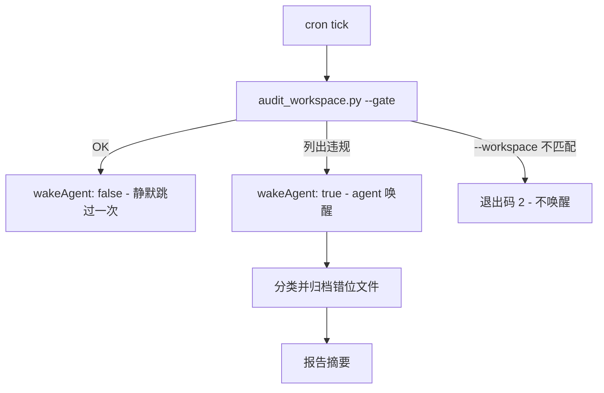
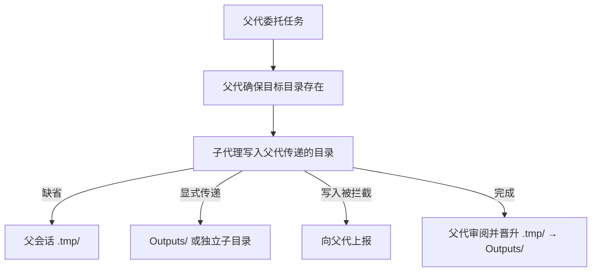



# dir-whip

[](https://opensource.org/licenses/MIT)
[](https://github.com/shawVV1992/dir-whip)

[English](./README.md) | [中文版](./README-zh.md)

本文档与英文版 README 同步维护，两版结构镜像、内容一致。

每个产出文件的会话都可能把工作区搅乱：报告、草稿、临时文件散落在 agent
当时所在的目录里。**dir-whip** 为 [Hermes-agent](https://github.com/NousResearch/hermes-agent)
的每次对话在工作目录（Initial Project Directory）内安一个唯一的家——带时间戳的
会话目录——并以三层保障强制执行：捆绑技能教导纪律、插件以 9 个钩子在落地前
拦截违规、审计层捕获漏网之鱼。

注意：dir-whip 权限范围仅限于工作目录（Initial Project Directory），工作目录之外的写入不受管控，新建的项目目录不受管控。

[核心能力](#核心能力) ·
[安装与快速上手](#安装与快速上手) · [工作原理](#工作原理) ·
[命令](#命令) · [效果演示](#效果演示) · [高级用法](#高级用法) ·
[安全与风险](#安全与风险) · [License](#license)

## 核心能力

1. **教罚结合：** skill 教纪律、plugin 强制执行，默认工作区管理纪律有效稳定，文件管理不再混乱。
2. **插件的双层检测：** 在插件中，前置层拦截根级违规写入并附修正指引；审计层以快照 diff 事后兜底——并配同轮自愈（`dir_whip_settle`）与 `pre_verify` 续轮兜底。
3. **可观测：** 定义 7 类 `dir-whip:*` 事件保存至 stats.jsonl（5 MB 滚动），可观测溯源。
4. **定时治理：** 针对 cron 任务采用 wakeAgent / [SILENT] 模式，不打断 agent 执行。下次 cron tick 继续治理。
5. **子代理纪律：** 子代理写入父代指定目录，绝不自行创建会话目录。
6. **项目模式感知：** 当活跃 Hermes 项目包含 agent CWD 时，会话开始提醒整体跳过（`skipped-project`）。

## 安装与快速上手

### 前置要求

- 安装 Hermes 0.20.0 或更高版本。
- 安装命令需要可访问 GitHub。

### 快速上手

1. 安装插件及其捆绑的技能、脚本与配置模板

```bash
hermes plugins install shawVV1992/dir-whip/dir-whip --enable
```

2. 重启 Hermes —— 插件在下一次会话生效

3. 验证生效配置及其来源
```bash
/dir-whip
```

应看到 `State: ACTIVE` —— 完整样例见[效果演示](#效果演示)。

插件在重启 Hermes 后生效。无需安装脚本，也无需单独安装技能。

### 更新

```bash
hermes plugins install shawVV1992/dir-whip/dir-whip --force
```

重装不会清除 `dir-whip-config.yaml`。

### 卸载

```bash
hermes plugins remove dir-whip
```

### 开启 / 关闭

```bash
# 开启插件
hermes plugins enable dir-whip

# 关闭插件
hermes plugins disable dir-whip

```

## 工作原理

### 设计思路

- **教罚分离** —— skill 与 plugin 零运行时耦合，只共享同一份配置与同一套
  判定规则。
- **允许误放、绝不误拦** —— 前置层fail-open策略，审计层可靠兜底。
- **观察事实，而非推断意图** —— 审计层 diff 实际落盘的文件，而非解析
  命令字符串。

### 功能架构

| 层 | 职责 | 形态 |
|----|------|------|
| **Skill（教导）** | 纪律参考 | 捆绑的 `workspace-organization` 技能（可选加载）+ 一条条件化会话开始提醒（≤280 字符，仅当 agent CWD 位于工作目录内且无活跃项目覆盖时注入） |
| **Plugin（强制）** | 拦截违规落地前 | 9 个钩子：`pre_tool_call` 拦截 + 写入审计 + 会话/子代理观察 + `pre_verify` 续轮兜底 |
| **Scripts（工具）** | Agent 和 cron 的 CLI 辅助 | `create_session_dir.py` / `audit_workspace.py` / `workspace_resolver.py` |
| **Config** | 唯一配置源 | `dir-whip-config.yaml` |
| **Observability** | 记录与报告 | stats.jsonl + `dir-whip:*` 事件 + `/dir-whip` |

每个产生文件的 Hermes 对话都会在工作目录根部得到一个会话目录：

```
<Working Directory>/
├── (严格空白名单；通过 /dir-whip allow 添加)
├── 20260822_143000_ReportTask/    # 会话目录（懒创建）
│   ├── Outputs/                   # 正式交付物
│   └── .tmp/                      # 中间文件（可按时间清理）
└── .hermes/                       # Hermes 自身目录
```

- 命名 `YYYYMMDD_HHMMSS_TaskName/`，时间戳必须真实（插件校验）。
- 懒创建：首次文件写入时才建，不产出文件的对话不建目录。
- 根目录只允许三样东西：白名单 `files` 条目、会话格式目录、`.hermes/`。

### 执行策略

终端写入在 shell 层拦截：重定向（`>` `>>` `1>`
`2>`）、`touch`，以及 `cp`/`mv` 的目标路径。双层纪律执行：


**前置层（宽容快速）** —— 设计原则是**允许误放、绝不误拦**：

- 链感知提取按 `&&` / `;` / `|` /
  换行切分命令链，仅在每个命令段内提取写入目标。
- 以 `=` 开头的重定向目标被排除。
- 设备路径（`/dev/null`、`/dev/stdout`、`/dev/stderr`）在归一化前豁免。
- 含 `<<`
  （heredoc）的命令整体降档至"放行并记入日志"，不解析正文。

**审计层（可靠主干）**：

- 对根目录文件条目做前后快照 diff，捕获前置层漏过的任何文件。
- 检测到违规时，L1 通告写明路径与处置——包括 `dir_whip_settle`
  自愈工具，可将违规文件移入审计隔离区并在同轮重新开闸。
- L3 闸门冻结后续所有写入类工具调用，直至文件被移除或移入合法位置。

> **闸门须知（真机实测）。** 闩锁期间*所有*写入类调用都会被冻结——包括
> `rm`，因此会话内删除无法解除闩锁。合规出路：调用 `dir_whip_settle`
> （把文件移入 `.hermes/audit-quarantine/`）、把文件移入会话目录、登记进
> `allowlist`（`files` / `dirs` 条目）、经 `dir_whip_allow_path`
> 授权该路径，或在带外直接移除文件。闩锁本身仅限当前会话：文件一旦不在
> 根目录，后续写入即恢复放行。另注意：对 `AGENTS.md` 的写入还会被 Hermes 自身
> 的 agent 指令保护门额外拦截，需要交互式批准——与 dir-whip 的判定无关。

### 能力边界

| 管 | 不管 |
|----|------|
| 根目录非白名单写入（`write_file` / `patch` / `terminal`） | 会话目录内的写入 |
| 根写入事后审计 + 清偿闸门 | 根白名单文件（`allowlist` `files` 条目） |
| 会话目录结构合规（audit 脚本） | 目录白名单（`allowlist` `dirs` 条目 + 运行时白名单） |
| | Working Directory 之外的一切（放行 + 日志） |
| | 只读工具与只读命令 |
| | 删除操作（仅记账，永不判违规） |

## 命令

### 命令清单

| 命令 | 作用 | 示例 |
| ---- | ---- | ---- |
| `/dir-whip` | 输出合并报告（字段见「报告字段」） | `/dir-whip` |
| `/dir-whip list` | 查看当前白名单（两段式编号列表） | `/dir-whip list` |
| `/dir-whip allow` | 枚举根目录候选（两段式编号列表 + Add 提示） | `/dir-whip allow` |
| `/dir-whip allow <编号\|名称\|路径>` | 登记条目，逗号批量；现存路径按磁盘判别（目录→`dirs`、文件→`files`），不存在路径走确认-创建协议 | `/dir-whip allow notes.txt` · `/dir-whip allow projects/foo` · `/dir-whip allow 1,3` · `/dir-whip allow docs/ --create` |
| `/dir-whip remove` | 枚举当前条目（两段式编号列表 + Remove 提示） | `/dir-whip remove` |
| `/dir-whip remove <编号\|名称>` | 移除条目；按名称匹配、不做磁盘判别（双段同名一并移除） | `/dir-whip remove 2` · `/dir-whip remove notes.txt` |

子命令 `allow|remove|list` 通过 `config_writer` 管理白名单（行级编辑，保留注释）。

### 报告字段

`/dir-whip` 输出一份合并报告：

| 字段 | 含义 |
| ---- | ---- |
| `[dir-whip] v<version>` | 插件版本，取自插件的 plugin.yaml（读取失败显示 `unknown`） |
| `State` | `ACTIVE`，或 Working Directory 无法解析时的 `FAIL-OPEN` |
| `Working Directory` | 生效值 + 解析来源（见下一行） |
| source | `guard-config`（dir-whip-config.yaml）· `profile-config`（档案 `terminal.cwd`）· `fail-open` |
| `Terminal Guard` | `enabled` / `disabled`（`terminal_guard`） |
| `Allowlist` | `Files: (none)` 或逗号分隔的根文件 basename + `Dirs: (none)` 或逗号分隔的相对目录路径，或键缺失时 `(strict empty allowlist)`（`allowlist`）；被忽略的遗留平铺值会追加计数 |
| `Reminder` | 会话开始纪律块注入结果：`injected` / `skipped-outside` / `skipped-child` / `skipped-project` / `unavailable`（首次会话开始前为 `(not recorded)`） |
| `Health` | `OK`，或 `PROBLEM` 并逐行列问题（解析、stats.jsonl 可写性） |
| `Stats File` | stats.jsonl 的绝对路径 |

### 共享语义

- 编号映射进两段式编号列表：Files 段后 Dirs 段，共用一段连续编号。
- 路径参数接受相对或绝对输入；根外/根自身输入被引导拒绝。
- `--create` 按输入形态创建产物：带末尾斜杠或嵌套路径→目录，裸文件名→根级文件。
- 未知参数输出 `Usage: /dir-whip [allow|remove|list]`。

### Agent 工具

`dir_whip_allow_path(path)` 是插件的常驻工具：当用户在对话中明确指定
目标路径时，写入前调用它以注册该路径。该记录仅对当前会话有效，并与
`allowlist` `dirs` 条目在 Tier 0 合并。第二个工具 `dir_whip_settle(paths)`
在首次写入审计通告时懒注册，把违规的根文件移入审计隔离区（同轮自愈）。

## 效果演示

以下插件消息均为源码原文；仅长路径做了缩略。

### 1. 前置层拦截根级写入

```text
你：   把今天的站会要点存成 notes.txt。

Agent: echo "Standup notes ..." > notes.txt        # 根级写入

BLOCKED: File writes in the Working Directory require a Session Directory or an allowed root file.
Target: notes.txt
Fix: Create a session directory first:
  python <plugin>/skills/workspace-organization/scripts/create_session_dir.py <task_name> --workspace <Working Directory>
Then write the deliverable to Outputs/<filename> (or scratch to .tmp/<filename>).
User-specified path -> dir_whip_allow_path first.
If this is a project directory, add it to the allowlist dirs in HERMES_HOME/dir-whip/dir-whip-config.yaml (relative to the Working Directory root, e.g. projects/foo)
Reply using the [Reason]/[Next] template.

Agent: python .../scripts/create_session_dir.py StandupNotes --workspace <WD>
       # 创建 20260827_100000_StandupNotes/
Agent: .../20260827_100000_StandupNotes/Outputs/notes.txt   # 干净落盘
```

### 2. 审计层捕获漏网之鱼——并同轮自愈

```text
Agent: （一次写入绕过前置层，落在了根目录）

[dir-whip] Write audit: the following file(s) were written to the Working Directory root outside any Session Directory:
  - notes.txt
Remediate now: call dir_whip_settle(paths=["notes.txt"]) to move the file(s) into quarantine (<root>/.hermes/audit-quarantine/), or move them manually into a Session Directory (YYYYMMDD_HHMMSS_TaskName/Outputs|.tmp/), or add them to the allowlist files entries in dir-whip-config.yaml (files: [notes.txt]). Further writes to the Working Directory are blocked until then.

Agent: dir_whip_settle(paths=["notes.txt"])
       # 文件移入 .hermes/audit-quarantine/<timestamp>/，闸门重新打开
```

### 3. `/dir-whip` 报告实时状态

```text
/dir-whip

[dir-whip] v0.5.0
State: ACTIVE
Working Directory: E:/HermesWorkspace/default  (source: guard-config)
Terminal Guard: enabled
Allowlist: Files: README.md  Dirs: projects/foo
Reminder: injected
Health: OK
Stats File: C:/Users/me/AppData/Local/hermes/dir-whip/stats.jsonl
```

## 高级用法

### 可选配置

可选、由用户维护，位于 `HERMES_HOME/dir-whip/dir-whip-config.yaml`
（Windows：`%LOCALAPPDATA%/hermes/dir-whip/dir-whip-config.yaml`；POSIX：
`~/.hermes/dir-whip/dir-whip-config.yaml`）。

| 键 | 含义 |
| --- | ---- |
| `allowlist` | 结构化映射：`files` = 根级文件 basename，`dirs` = 相对工作目录的目录路径（递归子树豁免；允许多级）；键缺失时严格空回退；遗留平铺值 fail-closed 忽略 |
| `working_dir_root` | 显式工作目录覆盖；缺省回退 = 当前档案 `terminal.cwd` |
| `terminal_guard` | 开关终端写入拦截（默认：enabled） |
| `write_audit` | 开关根写入事后审计（默认：enabled） |
| `write_audit_entry_cap` | 根目录条目数超过此值时跳过审计轮（默认：2000） |

```yaml
allowlist:
  files: []   # 根级文件 basename，如 ["README.md", "notes.txt"]
  dirs: []    # 相对目录路径，递归子树豁免，如 ["projects/foo"]
# working_dir_root: E:/HermesWorkspace/default   # 可选覆盖
# terminal_guard: enabled                        # 缺省即此值
# write_audit: enabled                           # 缺省即此值
# write_audit_entry_cap: 2000                    # 缺省即此值
```

> 配置位于 `dir-whip-config.yaml` —— 可手改，也可通过
> `/dir-whip allow <编号|名称|路径>|remove|list` 快捷修改（config_writer 行级编辑，保留注释）。
> 不带参数的 `/dir-whip` 仍为只读报告。

**工作目录解析。** 解析分三步：dir-whip-config.yaml 中显式 `working_dir_root`
优先；否则取当前档案的 `terminal.cwd`；两者皆不可用时回退到当前工作目录并
发出 WARNING。`/dir-whip` 会报告取值及其来源。

### 定时治理模式

`audit_workspace.py --gate` 是 Hermes cron 任务的零 token 预检门：



```bash
# Cron 任务：script= scripts/audit_workspace.py --gate
#            skill= dir-whip:workspace-organization
#            prompt: "If audit found violations, classify and archive misplaced
#                     files. If no violations, respond with [SILENT]."
```

- stdout 为 "OK" → `{"wakeAgent": false}` → 静默跳过一次，不投递
- stdout 列出违规 → `{"wakeAgent": true}` → agent 被唤醒、分类并把文件移入
  会话目录
- `--workspace` 不匹配 → 退出码 2、不发出 wakeAgent（边界配置错误属于系统
  问题，而非治理场景）

### 子代理模式

父代理把任务委托给子代理时，遵循以下文件协议：



- 父代在委托前确保目标目录存在（必要时先创建会话目录）。
- 子代理写入父代传递的目标目录：缺省为父会话 `.tmp/`；父代可显式传递
  `Outputs/` 路径（正式交付物），或为每个子代理指定独立子目录
  （如 `.tmp/<task>/`）。
- 子代理不自建会话目录、不自晋升产物（`.tmp/` → `Outputs/` 晋升归父代
  审阅）。
- 目标目录缺失或写入被拦截时，子代理向父代上报，而非自行创建会话目录。
- 插件对子代理写入的判定与父代一致；统计按子代理切分记录。

### 统计

每次判定以一行 JSON 追加写入 `HERMES_HOME/dir-whip/stats.jsonl`。每行含
会话字段（`profile` / `session_id` / `is_subagent` / `started_at`）与事件
字段（`ts` / `outcome` / `reason` / `tool` / `rule_key` / `target`）。记录
范围：拦截判定、运行时豁免、审批观察，以及写入审计的违规与闸门拦截
（`write-audit-violation` / `write-audit-gate-block`），按子代理切分。
`target` 一律相对 Working Directory 记录，外部路径哈希前缀或省略——不含
文件内容、绝对路径或提示词文本。超过 5 MB 滚动为 `stats.jsonl.1`；跨会话
汇总经 `/dir-whip` 报告的 Stats File 路径查看。

## 安全与风险

dir-whip 是纪律辅助工具，不是安全边界。

**可能出什么问题。** Agent 可能被提示词引导写入任意位置；提示注入可能把写入
推送到意料之外的位置。扩大 `allowlist`（`dirs` 条目）或关闭插件都会让工作区失去管理。
配置错误并非总能一眼可见。

**内置防护。** 强制发生在 `pre_tool_call` 钩子中，先于写入落地。前置层漏过的
根级写入由审计层事后捕获（快照 diff），清偿前冻结后续写入。配置异常时
fail-open 并发出 WARNING，绝不静默。外部写入放行但记入日志。统计经过隐私
裁剪。`--workspace` 不匹配时审计门拒绝唤醒 agent，`/dir-whip` 的
Health 可核验配置与统计健康。

## License

[MIT](./LICENSE) —— 见 [LICENSE](./LICENSE) 文件。不捆绑任何第三方组件。
