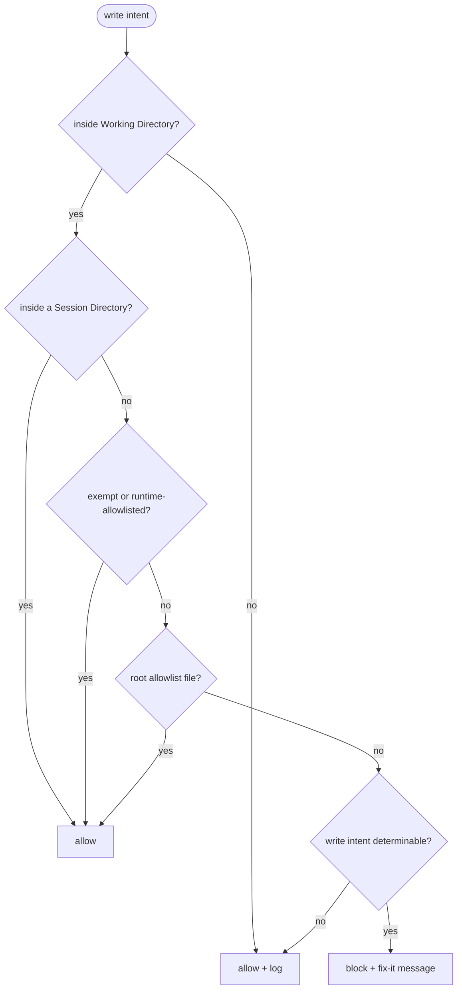

# dir-whip

[](https://opensource.org/licenses/MIT)
[](https://github.com/shawVV1992/dir-whip)

[中文版](./README-zh.md) | [English](./README.md)

dir-whip enforces Working Directory file discipline for Hermes agents.
A bundled `workspace-organization` skill teaches the rules; a plugin with 7
hooks blocks violations before they land. Version 0.2.0 — installable with 1
command on Windows, Linux, WSL, and macOS.

[Installation & Quick Start](#installation--quick-start) ·
[What It Guards](#what-it-guards) · [Commands](#commands) ·
[Configuration](#configuration) ·
[Advanced Usage](#advanced-usage) · [Security & Risk](#security--risk) ·
[Contributing](#contributing) · [License](#license)

## Why

- **Two layers, one package** — the skill teaches, the plugin enforces; 1
  native command installs both.
- **Enforcement before violation** — 7 hooks intercept file writes; root-level
  violations are blocked with a fix-it message.
- **Zero-config discipline** — an always-on prompt (≤500 chars) ships by
  default; misconfiguration fails open with a WARNING, never in silence.
- **Scheduled governance** — `audit_workspace.py --gate` powers zero-token
  cron pre-runs with the wakeAgent / [SILENT] pattern.
- **Observable by design** — 1 slash command, 5 `dir-whip:*` events,
  and privacy-trimmed stats.jsonl (5 MB rollover).
- **Cross-platform** — Windows 10+, Linux, WSL, and macOS.

## Features

| Area | Capability |
| ---- | ---------- |
| **Plugin guard** | 7 hooks block root writes outside Session Directories; external writes allow + log |
| **Bundled skill** | `workspace-organization` bundled: discipline reference + audit workflow |
| **Quick commands** | `/dir-whip` merged report; `dir_whip_allow_path` session exemption tool |
| **Cron governance** | `audit_workspace.py --gate` zero-token cron pre-runs (wakeAgent / [SILENT]) |
| **Subagents** | children write to parent-designated dirs; never self-create Session Directories |
| **Observability** | stats.jsonl (5 MB rollover, privacy-trimmed) + 5 `dir-whip:*` events |

## Installation & Quick Start

### Prerequisites

- Hermes CLI or desktop with plugin support (manifest v2).
- Network access to GitHub for the install command.

### Quick Start

```bash
# 1. Install the plugin plus the bundled skill, scripts, and config template
hermes plugins install shawVV1992/dir-whip/dir-whip --enable

# 2. Restart Hermes — the guard activates on the next session

# 3. Verify the effective configuration and its source
/dir-whip
```

> **Note for AI assistants:** If you are an AI agent asked to install or
> verify dir-whip, run step 1 (user approval may be required) and report
> that a restart is needed — do not test file writes in the current
> session. For the full discipline reference, load the bundled skill
> explicitly with `dir-whip:workspace-organization`.

The guard becomes active after the next Hermes restart. No installer script
and no separate skill install are needed.

### Update

```bash
hermes plugins install shawVV1992/dir-whip/dir-whip --force
```

`dir-whip-config.yaml` is preserved across reinstalls.

### Uninstall

```bash
hermes plugins remove dir-whip
```

### Enable / Disable

```bash
# On — install with the plugin enabled
hermes plugins install shawVV1992/dir-whip/dir-whip --enable

# Off
hermes plugins disable dir-whip

# Restore default — re-enable
hermes plugins enable dir-whip
```

## What It Guards

Every Hermes conversation that produces files gets one Session Directory at
the Working Directory root, named `YYYYMMDD_HHMMSS_TaskName/`, with `Outputs/`
for formal deliverables and `.tmp/` for intermediate files.



> TODO: diagram to be completed (e.g. terminal write observation path).

Terminal writes are intercepted at the shell level: redirects (`>` `>>` `1>`
`2>`), `touch`, and `cp`/`mv` destinations. Complex pipelines are observed,
not parsed.

## Commands

`/dir-whip` prints one merged report:

| Field | Meaning |
| ----- | ------- |
| `[dir-whip] v<version>` | Plugin version from plugin.yaml (`unknown` if unreadable) |
| `State` | `ACTIVE`, or `FAIL-OPEN` when the Working Directory could not be resolved |
| `Working Directory` | Value + resolving source (see next row) |
| source | `guard-config` (dir-whip-config.yaml) · `profile-config` (profile `terminal.cwd`) · `fail-open` |
| `Terminal Guard` | `enabled` / `disabled` (`terminal_guard`) |
| `Exempt Paths` | Comma-joined exempt paths, or `(none)` (`exempt_paths`) |
| `Root Allowlist` | Comma-joined allowlist, or `(strict empty allowlist)` if missing (`allowed_root_files`) |
| `Health` | `OK`, or `PROBLEM` with one line per issue (resolution, stats.jsonl writability) |
| `Stats File` | Absolute path to stats.jsonl |

There are no subcommands: any argument prints `Usage: /dir-whip`.

`dir_whip_allow_path(path)` is the plugin's only tool: call it before writing
when the user explicitly names a target path in the conversation. The entry
lasts for the current session only and merges with `exempt_paths`.

## Configuration

Optional and user-managed, at `HERMES_HOME/dir-whip/dir-whip-config.yaml`
(Windows: `%LOCALAPPDATA%/hermes/dir-whip/dir-whip-config.yaml`; POSIX:
`~/.hermes/dir-whip/dir-whip-config.yaml`).

| Key | Meaning |
| --- | ------- |
| `exempt_paths` | Paths exempt from enforcement (prefix match, absolute, forward slashes) |
| `allowed_root_files` | Root filenames allowed; strict empty-list fallback |
| `working_dir_root` | Explicit Working Directory override; fallback = profile `terminal.cwd` |
| `terminal_guard` | Enable/disable terminal write interception (default: enabled) |

```yaml
exempt_paths: []
allowed_root_files: ["AGENTS.md"]
# working_dir_root: E:/HermesWorkspace/default   # optional override
# terminal_guard: enabled                        # default when absent
```

**Working Directory resolution.** Resolution follows three steps: explicit
`working_dir_root` in dir-whip-config.yaml wins; otherwise the current profile's
`terminal.cwd` is used; if both fail, the guard falls back to the current
working directory with a WARNING. `/dir-whip` reports the value
and its source.

## Advanced Usage

**Cron governance.** `audit_workspace.py --gate` is a zero-token pre-run gate
for Hermes cron jobs:

```bash
# Cron job: script= scripts/audit_workspace.py --gate
#           skill= dir-whip:workspace-organization
#           prompt: "If audit found violations, classify and archive misplaced
#                    files. If no violations, respond with [SILENT]."
```

- stdout "OK" → `{"wakeAgent": false}` → silent tick, no delivery
- stdout lists violations → `{"wakeAgent": true}` → the agent wakes, classifies,
  and moves files into Session Directories
- `--workspace` mismatch → exit 2, no wakeAgent (a misconfigured boundary is a
  system problem, not a governance situation)

**Subagent mode.** When a parent agent delegates to subagents, it follows this
file protocol:

- The parent ensures the target directory exists before delegating (creating
  a Session Directory first when needed).
- The child writes to the parent-passed target directory: the parent session's
  `.tmp/` by default; the parent may explicitly pass an `Outputs/` path (formal
  deliverables) or a per-subagent subdirectory (e.g. `.tmp/<task>/`).
- The child never self-creates a Session Directory and never self-promotes
  (`.tmp/` → `Outputs/` promotion is the parent's review step).
- When the target directory is missing or a write is blocked, the child
  reports to the parent instead of creating a Session Directory itself.
- Guard verdicts for subagent writes are identical to the parent's; stats are
  split by subagent.

**Statistics.** Every verdict is appended as one JSON line to
`HERMES_HOME/dir-whip/stats.jsonl` — no file contents, no absolute
paths, no prompt text. At 5 MB the file rolls over to `stats.jsonl.1`.
See the Stats File path shown by `/dir-whip` for cross-session totals.

## Security & Risk

dir-whip is a discipline aid, not a security boundary.

**What can go wrong.** An agent may be prompted to write anywhere; a prompt
injection can push writes to unexpected locations. Widening `exempt_paths` or
disabling the guard leaves the workspace unmanaged. Misconfiguration is not
always visible without a check.

**Built-in protections.** Enforcement happens in the `pre_tool_call` hook
before a write lands. Misconfiguration fails open with a WARNING, never in
silence. External writes are allowed but logged. Stats are privacy-trimmed.
The audit gate refuses to wake agents when `--workspace` mismatches, and
`/dir-whip`'s Health verifies config and stats health.

## Contributing

Bug reports, feature requests, and pull requests are welcome:
[github.com/shawVV1992/dir-whip](https://github.com/shawVV1992/dir-whip).
Development is spec-driven; the authoritative spec lives in the repository.

## License

[MIT](./LICENSE) — see the [LICENSE](./LICENSE) file. No third-party
components are bundled.
