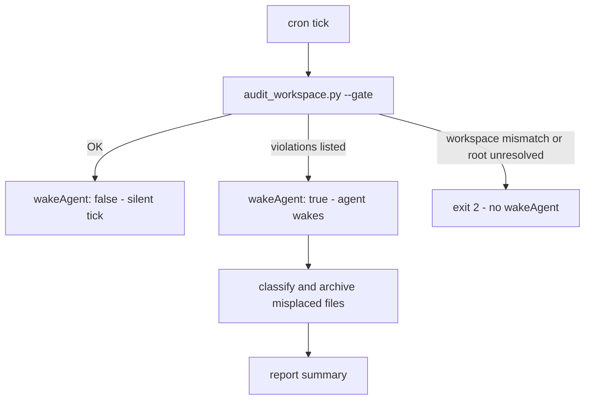
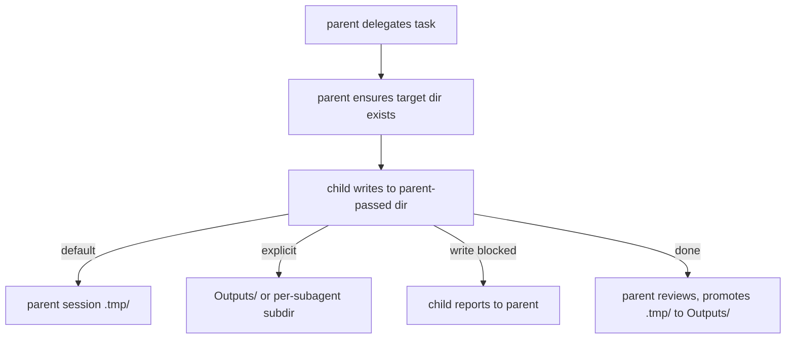



# dir-whip

[](https://opensource.org/licenses/MIT)
[](https://github.com/shawVV1992/dir-whip)

[中文版](./README-zh.md) | [English](./README.md)

Every session that produces files risks the same mess: reports, scratch
files, and downloads all land wherever the agent happened to be standing.
**dir-whip** gives every [Hermes-agent](https://github.com/NousResearch/hermes-agent)
conversation one home for its output inside the Working Directory (Initial
Project Directory) — a timestamped Session Directory — enforced in three
layers: a bundled skill teaches the discipline, the plugin blocks violations
before they land with 9 hooks, and the audit layer catches what slips
through.

**Note:** dir-whip only applies to the Working Directory (Initial Project
Directory). Writes outside the Working Directory and newly created project
directories are not subject to enforcement.

[Core Capabilities](#core-capabilities) ·
[Installation & Quick Start](#installation--quick-start) ·
[How It Works](#how-it-works) · [Commands](#commands) ·
[See It In Action](#see-it-in-action) · [Advanced Usage](#advanced-usage) ·
[Security & Risk](#security--risk) · [License](#license)

## Core Capabilities

1. **Teach and enforce combined.** The skill teaches discipline, the plugin
   enforces it — reliable workspace management, no more file chaos.
2. **Dual-layer detection + backstop tools.** The front layer blocks,
   before they land, writes outside the allowlist and Session Directories
   (root-level files and non-session subdirectories alike) with a fix-it
   message; the audit layer snapshot-diffs allowed terminal commands to
   catch what slips past — with same-turn self-heal (`dir_whip_settle`)
   and a dir-whip continuation nudge.
3. **Observable.** 7 `dir-whip:*` events recorded to stats.jsonl
   (5 MB rollover) for audit and diagnostics.
4. **Scheduled governance.** wakeAgent / [SILENT] pattern for cron tasks
   — no interruption to agent execution; next cron tick continues
   governance.
5. **Subagent discipline.** Children write to parent-designated
   directories; they never self-create Session Directories.
6. **Project-mode aware.** When an active Hermes project contains the
   agent CWD, the session-start reminder is skipped entirely
   (`skipped-project`).

## Installation & Quick Start

### Prerequisites

- Hermes 0.20.0 or higher.
- Network access to GitHub for the install command.

### Quick Start

```bash
# 1. Install the plugin plus the bundled skill, scripts, and config template
hermes plugins install shawVV1992/dir-whip/dir-whip --enable

# 2. Restart Hermes — the plugin activates on the next session

# 3. Verify the effective configuration and its source
/dir-whip
```

Expect `State: enabled` — see [See It In Action](#see-it-in-action) for a
full sample report.

The plugin becomes active after the next Hermes restart. No installer script
and no separate skill install are needed.

### Update

```bash
hermes plugins install shawVV1992/dir-whip/dir-whip --force
```

`dir-whip-config.yaml` is preserved across reinstalls.

### Uninstall

```bash
hermes plugins remove dir-whip
```

### Enable / Disable

```bash
# On
hermes plugins enable dir-whip

# Off
hermes plugins disable dir-whip
```

## How It Works

### Design Principles

- **Teach and enforce separately** — the skill and the plugin share zero
  runtime coupling; they only share one config file and one verdict rule set.
- **Allow false passes, never false blocks** — the front layer is deliberately
  permissive; the audit layer is the reliable backbone.
- **Observe facts, not intent** — the audit layer diffs what actually landed
  on disk instead of parsing command strings.

### Architecture


| Layer | Role | Form |
|-------|------|------|
| **Config** (`dir-whip-config.yaml`) | Sole configuration source; Skill and Plugin have zero runtime coupling and meet only at this file (teach / enforce split) | `allowlist` files/dirs + `working_dir_root` keys; hand-edited or row-level edited via `/dir-whip` |
| **Skill (teaches, incl. Scripts tools)** | Discipline reference + CLI helpers | Bundled `workspace-organization` skill (opt-in) + one conditional session-start reminder (≤280 chars, injected only when the agent CWD is inside the Working Directory and no active project covers it); scripts `create_session_dir.py` / `audit_workspace.py` / `workspace_resolver.py` (create · audit · resolve) |
| **Plugin (enforces)** | Intercepts violations before they land and handles the backstop | 9 hooks in three groups (as drawn): **front-layer interception** (`pre_tool_call` pre-landing three-tier verdict), **audit-layer backstop** (snapshot diff + L1 notice + L3 gate), **backstop tools** (`dir_whip_allow_path` / `dir_whip_settle` / `/dir-whip`); plus the `pre_verify` continuation nudge and observe-only hooks |
| **Observability** | Records and reports | stats.jsonl (5 MB rollover) + 7 `dir-whip:*` events + dir-whip.log + the `/dir-whip` merged report |

Every Hermes conversation that produces files gets one Session Directory at
the Working Directory root:

```
<Working Directory>/
├── (strict empty allowlist; add via /dir-whip allow)
├── 20260822_143000_ReportTask/    # Session Directory (lazy-created)
│   ├── Outputs/                   # formal deliverables
│   └── .tmp/                      # intermediate files (age-cleanable)
└── .hermes/                       # Hermes internal
```

- Named `YYYYMMDD_HHMMSS_TaskName/` with a real timestamp (the plugin
  validates it).
- Created lazily at the first file write — conversations that produce no
  files create no directory.
- The root allows exactly three things: allowlist `files` entries,
  session-format directories, and `.hermes/`.

### Enforcement

The runtime flow is built on the four-level audit ladder of spec §5.18:

| Level | Name | Mechanism & surface |
|-------|------|---------------------|
| **L1** | teach | The fire-once notice — the only in-conversation prompt naming violations and remedies (`transform_tool_result` hook, enters the conversation exactly once) |
| **L2** | record | `write-audit-violation` / `write-audit-gate-block` stats rows and bus events — background observability only, never in the conversation, never blocking |
| **L3** | gate | The unresolved-violation latch — freezes all write-class calls until settlement completes |
| **L4** | remediate | Remedies and fallback — `dir_whip_settle` / move into a Session Directory / user `/dir-whip allow` / out-of-band removal |


`write_file` / `patch` are judged by target path; terminal commands are
lexically tiered at the shell level. Two layers, two responsibilities — the
front layer owns pre-landing, the audit layer owns post-landing:

**Front layer (interception, permissive and fast)** — designed on **allow
false passes, never false blocks**:

- Only three write-class tools are judged: `write_file` / `patch` /
  `terminal`; other tools and read-only commands never enter the chain.
- **Three-tier verdict**: deterministic targets (tool paths, terminal
  redirects / `touch` / `cp`·`mv` destinations) enter the unified classify
  chain; uncertain write intent (heredoc, interpreter-led segments, nested
  shells, `$`/backtick variables) is allowed + logged; device paths and
  read-only commands are silently exempt.
- **Chain-aware extraction**: command chains split on `&&` / `;` / `|` /
  newlines, targets extracted per segment; `=`-leading targets excluded.
- **Unified classify chain** (shared with the audit layer — the two can
  never disagree): Tier 0 allowlist / runtime exemption → outside the
  Working Directory allowed + logged → root-level allowlist file → Session
  Directory → otherwise block (`root-file` / `non-session-dir`), with
  fix-it guidance in the message.

**Audit layer (backstop, four-level ladder)** — observes only what allowed
terminal commands actually landed:

- **Snapshot diff**: pre/post root snapshots for allowed terminal commands
  only; root-level **file** entries only — directory changes never violate,
  deletions are record-only.
- **Pending set**: session-scoped; subagent violations post to the parent's
  set — the parent settles the latch.
- The four-level ladder (defined in the table above): **L1** the fire-once
  notice is the only in-conversation prompt; **L2** stats + events stay in
  the background; **L3** the latch freezes every write-class call (incl.
  `rm` and agent-driven config edits); **L4** four remedies — settle / move
  into a session dir (out-of-band) / user `/dir-whip allow` / out-of-band
  removal.
- **Settlement is config-only**: a runtime exemption is prospective-only
  and never clears a recorded violation.
- **pre_verify continuation nudge**: one more reminder when a turn ends
  with unresolved violations, capped at 3 per session.

> **Notes**
>
> - While latched, *every* write-class call is frozen — incl. `rm` and
>   agent-driven config edits; the latch cannot be cleared in-session.
> - A runtime exemption does **not** clear a recorded violation; the latch
>   is session-scoped — once the file leaves the root, writes pass again.

## Commands

### Command List

| Command | Action | Example | Notes |
| ------- | ------ | ------- | ----- |
| `/dir-whip` | Print the merged report (fields under "Report Fields") | `/dir-whip` | |
| `/dir-whip list` | Show the current allowlist (two-section numbered listing) | `/dir-whip list` | Files section first, Dirs second, one continuous numbering (the numbers used by allow / remove) |
| `/dir-whip allow` | Enumerate allowlist candidates (two-section numbered listing + Add hint) | `/dir-whip allow` | numbering same as `list` |
| `/dir-whip allow <number\|name\|path>` | Register entries into the allowlist, batch via commas; existing paths are classified disk-aware (directory → `dirs`, file → `files`), non-existent paths follow a confirm-create protocol | `/dir-whip allow notes.txt` · `/dir-whip allow projects/foo` · `/dir-whip allow 1,3` · `/dir-whip allow docs/ --create` | paths accept relative or absolute input; outside-root / root-itself inputs are rejected with guidance; `--create` decides the artifact by form: trailing slash or nested path → directory, bare name → root-level file |
| `/dir-whip remove` | Enumerate the allowlist's current entries (two-section numbered listing + Remove hint) | `/dir-whip remove` | numbering same as `list` |
| `/dir-whip remove <number\|name>` | Remove entries from the allowlist; matched by name with no disk discrimination (a hand-edited double entry is removed from both sets) | `/dir-whip remove 2` · `/dir-whip remove notes.txt` | numbers are the continuous two-section numbering |

### Report Fields

`/dir-whip` prints one merged report:

| Field | Meaning |
| ----- | ------- |
| `[dir-whip] v<version>` | Plugin version from plugin.yaml (`unknown` if unreadable) |
| `State` | `enabled`, or `disabled` when the Working Directory could not be resolved (fail-open; the guard is off) |
| `Working Directory` | Value + resolving source (see next row); `(unresolved)` when none |
| source | `guard-config` (dir-whip-config.yaml) · `profile-config` (profile `terminal.cwd`) · `fail-open` |
| `Allowlist` | Multi-line block: a header line plus one indented `Files:` / `Dirs:` line each; the single line `Allowlist: (strict empty allowlist)` when there is no entry at all; an ignored legacy flat value adds an indented count line |
| `WARNING` | Anomaly-only: the `working_dir_root` override differs from the profile `terminal.cwd` |
| `Stats File` | Absolute path to stats.jsonl |
| `Debug Log` | Absolute path to dir-whip.log, suffixed `(no records yet)` or `(unavailable)` |
| `Health` | `Good`, or `N issue(s)` with one indented line per issue (resolution FAIL-OPEN, stats.jsonl not writable) |

## See It In Action

Plugin messages below are quoted verbatim from the source; only paths are
abbreviated.

### 1. The front layer blocks a root-level write

```text
You:   Summarize today's standup and save it as notes.txt.

Agent: echo "Standup notes ..." > notes.txt        # root-level write

BLOCKED: File writes in the Working Directory require a Session Directory or an allowed root file.
Target: notes.txt
Fix: Create a session directory first:
  python <plugin>/skills/workspace-organization/scripts/create_session_dir.py <task_name> --workspace <Working Directory>
Then write the deliverable to Outputs/<filename> (or scratch to .tmp/<filename>).
User-specified path -> dir_whip_allow_path first.
If this is a project directory, add it to the allowlist dirs in HERMES_HOME/dir-whip/dir-whip-config.yaml (relative to the Working Directory root, e.g. projects/foo)
Reply using the [Reason]/[Next] template.

Agent: python .../scripts/create_session_dir.py StandupNotes --workspace <WD>
       # creates 20260827_100000_StandupNotes/
Agent: .../20260827_100000_StandupNotes/Outputs/notes.txt   # lands cleanly
```

### 2. The audit layer catches what slips through — and self-heals

```text
Agent: (a write slips past the front layer and lands at the root)

[dir-whip] Write audit: the following file(s) were written to the Working Directory root outside any Session Directory:
  - notes.txt
Remediate now: call dir_whip_settle(paths=["notes.txt"]) to move the file(s) into quarantine (<root>/.hermes/audit-quarantine/), or move them manually into a Session Directory (YYYYMMDD_HHMMSS_TaskName/Outputs|.tmp/). To keep the file(s) at the root, ask the user to add them to the allowlist files entries in dir-whip-config.yaml (files: [notes.txt]) — give them the exact command to run: /dir-whip allow <path> — while the block is active all writes are frozen (config edits included). Further writes to the Working Directory are blocked until then.

Agent: dir_whip_settle(paths=["notes.txt"])
       # file moves to .hermes/audit-quarantine/<timestamp>/, gate re-opens
```

### 3. `/dir-whip` reports the live state

```text
/dir-whip

[dir-whip] v0.6.2
State: enabled
Working Directory: E:/HermesWorkspace/default  (source: guard-config)
Allowlist:
  Files: README.md
  Dirs: projects/foo
Stats File: C:/Users/me/AppData/Local/hermes/dir-whip/stats.jsonl
Debug Log: C:/Users/me/AppData/Local/hermes/dir-whip/dir-whip/dir-whip.log
Health: Good
```

## Advanced Usage

### Optional Configuration

Optional and user-managed, at `HERMES_HOME/dir-whip/dir-whip-config.yaml`
(Windows: `%LOCALAPPDATA%/hermes/dir-whip/dir-whip-config.yaml`; POSIX:
`~/.hermes/dir-whip/dir-whip-config.yaml`).

| Key | Meaning |
| --- | ------- |
| `allowlist` | Structured mapping: `files` = root-level file basenames, `dirs` = Working-Directory-relative dir paths (recursive subtree exemption; multi-level allowed); strict empty fallback when the key is missing; legacy flat values are ignored fail-closed |
| `working_dir_root` | Explicit Working Directory override; fallback = profile `terminal.cwd`; `/dir-whip` prints a WARNING when the override differs from the profile value |

The `terminal_guard` / `write_audit` / `write_audit_entry_cap` keys were
removed (BREAKING): interception and the audit are always on, the audit
entry cap is a fixed 2000, and any leftover values in the config file are
ignored at runtime.

```yaml
allowlist:
  files: []   # root-level file basenames, e.g. ["README.md", "notes.txt"]
  dirs: []    # relative dir paths, recursive subtree, e.g. ["projects/foo"]
# working_dir_root: E:/HermesWorkspace/default   # optional override
```

> Configuration lives in `dir-whip-config.yaml` — edit by hand or via
> `/dir-whip allow <number|name|path>|remove|list` (row-level edit via
> config_writer, comments preserved). Bare `/dir-whip` without args is still a
> read-only report.

**Working Directory resolution.** The plugin resolves in three steps:
explicit `working_dir_root` in dir-whip-config.yaml wins; otherwise the
current profile's `terminal.cwd` is used; if both fail the plugin fails
open (the guard is off — `/dir-whip` shows `State: disabled` and lists a
Health issue). The CLI scripts use a longer chain: they additionally
enumerate profiles and fall back to the current working directory with a
stderr WARNING. `/dir-whip` reports the value and its source.

### Scheduled Governance

`audit_workspace.py --gate` is a zero-token pre-run gate for Hermes cron
jobs:



```bash
# Cron job: script= scripts/audit_workspace.py --gate
#           skill= dir-whip:workspace-organization
#           prompt: "If audit found violations, classify and archive misplaced
#                    files. If no violations, respond with [SILENT]."
```

- stdout "OK" → `{"wakeAgent": false, "violations": 0, "removed": 0, "failed": 0}`
  → silent tick, no delivery
- stdout lists violations → `{"wakeAgent": true, "violations": 2, "removed": 1, "failed": 0}`
  → the agent wakes, classifies, and moves files into Session Directories
- `--workspace` mismatch or a failed root resolution in gate mode → exit 2, no
  wakeAgent (a misconfigured boundary is a system problem, not a governance
  situation)

The gate payload always carries all four keys. `--gate` also auto-cleans
expired `.tmp/` entries (older than 30 days): `removed` / `failed` make
partial cleanup failures visible, failure details go to stderr, and the exit
code stays violations-driven (1 when violations exist, else 0).

### Subagent Mode

When a parent agent delegates to subagents, it follows this file protocol:



- The parent ensures the target directory exists before delegating (creating
  a Session Directory first when needed).
- The child writes to the parent-passed target directory: the parent session's
  `.tmp/` by default; the parent may explicitly pass an `Outputs/` path (formal
  deliverables) or a per-subagent subdirectory (e.g. `.tmp/<task>/`).
- The child never self-creates a Session Directory and never self-promotes
  (`.tmp/` → `Outputs/` promotion is the parent's review step).
- When the target directory is missing or a write is blocked, the child
  reports to the parent instead of creating a Session Directory itself.
- Verdicts for subagent writes are identical to the parent's; stats are
  split by subagent.

### Statistics

Every verdict is appended as one JSON line to
`HERMES_HOME/dir-whip/stats.jsonl`. Each line carries session fields
(`profile` / `session_id` / `is_subagent` / `started_at`) and event fields
(`ts` / `outcome` / `reason` / `tool` / `rule_key` / `target`). Recorded:
interception verdicts, runtime exemptions, approval observations, and the
write audit's violations and gate blocks (`write-audit-violation` /
`write-audit-gate-block`), split by subagent. `target` is always relative to
the Working Directory; external paths are hashed or omitted — no file
contents, no absolute paths, no prompt text. At 5 MB the file rolls over to
`stats.jsonl.1`; see the Stats File path shown by `/dir-whip` for
cross-session totals.

## Security & Risk

dir-whip is **behavioral monitoring and soft management**, **not a security
boundary**: it observes and corrects file behavior through the host tool
layer and cannot defend channels that bypass that layer (such as file I/O
inside a code-execution kernel).

**Enforced.**

1. **Write-class interception** — in `write_file` / `patch` / `terminal`,
   writes inside the Working Directory but outside the allowlist and
   Session Directories are blocked before they land (root-level files and
   non-session subdirectories alike; `root-file` / `non-session-dir`), with
   fix-it guidance in the message.
2. **Post-hoc root-file audit + settlement gate** — allowed terminal
   commands are re-checked via snapshot diff; slipped-through violations
   run the L1–L4 ladder until settled (see Enforcement).
3. **Session Directory structure compliance** — `audit_workspace.py`
   checks the Outputs/ and .tmp/ layout and cleans expired `.tmp` entries
   (the cron governance entry).

**Not enforced.**

1. **Arbitrary code execution** — file I/O inside an execution kernel
   (`execute_code` and similar) bypasses the guard, the audit, and the gate
   entirely; this is the largest blind spot.
2. **Uncertain write intent** — interpreter scripts, nested shells, variable
   paths, heredoc: allowed + logged; may slip through (the audit is the
   backstop).
3. **Allowlists and exemptions** — `allowlist` files / dirs, the runtime
   allowlist, and writes inside Session Directories: always allowed.
4. **Everything outside the Working Directory** — allowed + logged.
5. **Read-only tools and commands** — never enter the chain.
6. **Deletions** — record-only, never a violation.

**What can go wrong:**

- **Prompt injection** — the agent may be talked into writing anywhere, and
  the landing spot is not controllable. A hidden line in a web page or
  document it was asked to read ("save the result to ~/xxx") is enough:
  targets outside the Working Directory are allowed by design, leaving only
  the log for after-the-fact tracing.
- **Weakened defenses** — widening `allowlist` dirs or disabling the plugin
  leaves the workspace unmanaged. `allowlist` dirs is a recursive subtree
  exemption — one extra registered directory puts the whole subtree outside
  the discipline; `hermes plugins disable dir-whip` turns off all
  interception and auditing with one command.
- **Misconfiguration** — not always visible at a glance. A typo in an
  allowlist filename silently fails to exempt the file and shows up as a
  puzzling block; edits to the wrong profile's `dir-whip-config.yaml` never
  take effect. These hide in the behavior — hard to locate without reading
  the `/dir-whip` report.

**Built-in protections:**

- **Pre-landing interception** — enforcement happens in the `pre_tool_call`
  hook, before a write lands: violating targets are stopped with fix-it
  guidance before execution, so no dirty file is created and there is no
  "write first, clean up later" cost.
- **Post-landing backstop** — uncertain-tier commands may still land files
  via scripts; the audit layer snapshot-diffs the root and registers any
  new or modified root-level violation as pending, freezing every write
  until settlement completes.
- **No silent failures** — a config anomaly (e.g. an unresolvable Working
  Directory) fails open but also injects a WARNING instead of quietly doing
  nothing; when the boundary cannot be verified (`--workspace` mismatch or
  a failed root resolution) the gate refuses to wake the agent.
- **Minimal capability surface** — external writes are allowed but logged
  for after-the-fact auditing; `dir_whip_settle` accepts only paths in the
  current pending set, all-or-nothing, so even a manipulated agent has no
  arbitrary file-moving ability.
- **Verifiable** — every verdict appends one line to stats.jsonl
  (privacy-trimmed: no file contents, no absolute paths); `/dir-whip`'s
  Health and the Debug Log expose config source and stats health at any
  time.

## License

[MIT](./LICENSE) — see the [LICENSE](./LICENSE) file. No third-party
components are bundled.
