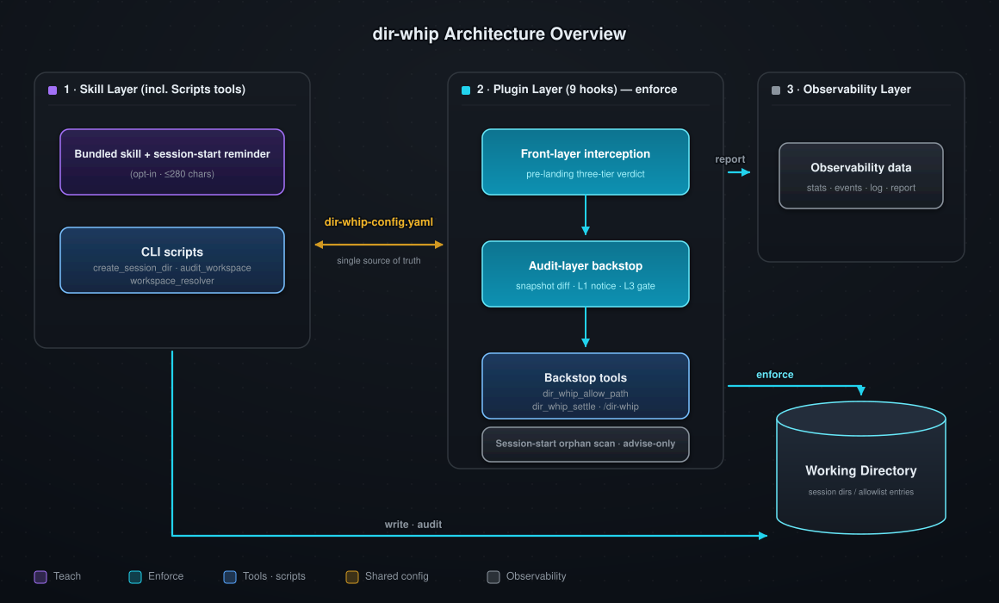
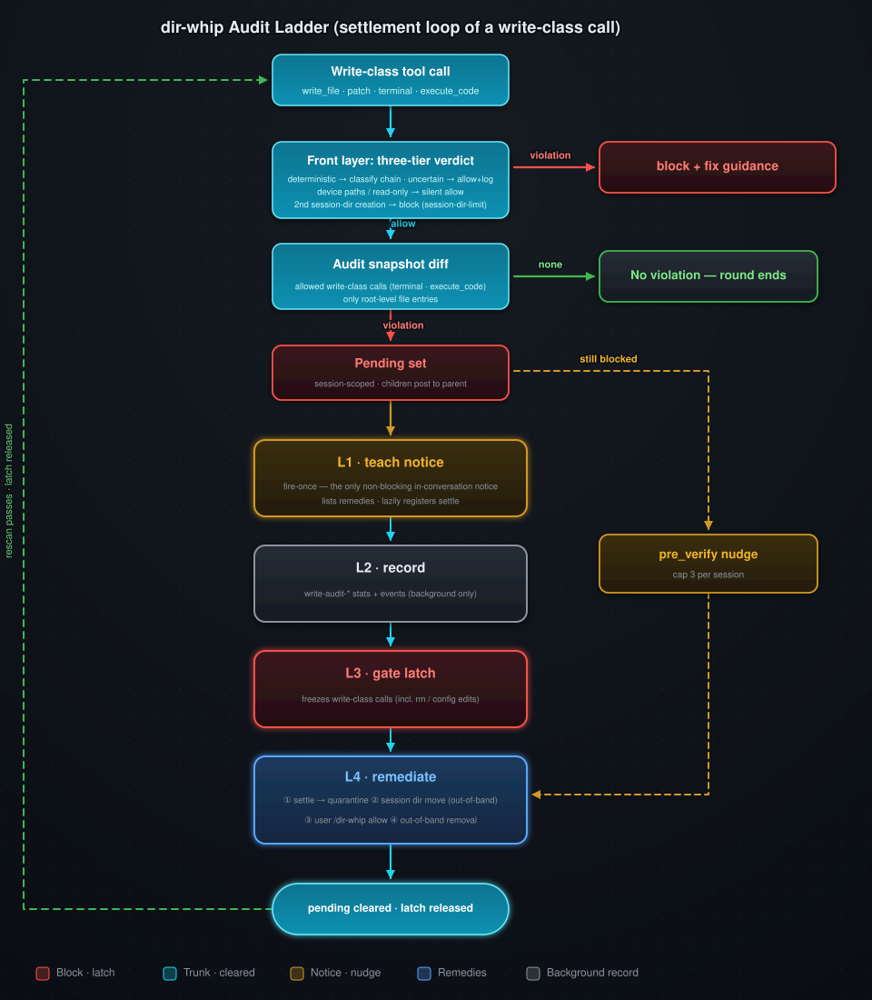
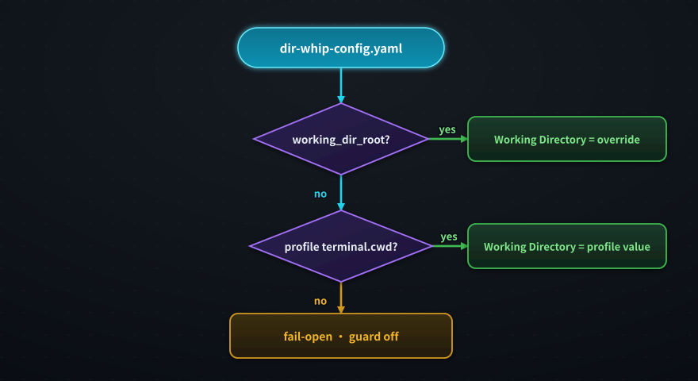
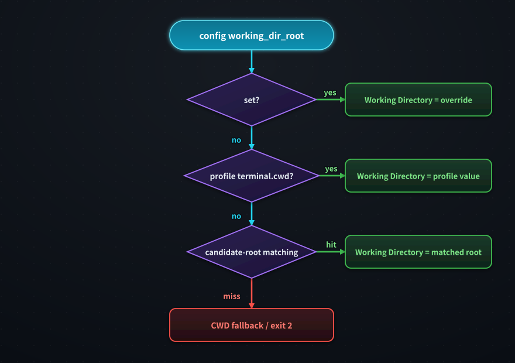
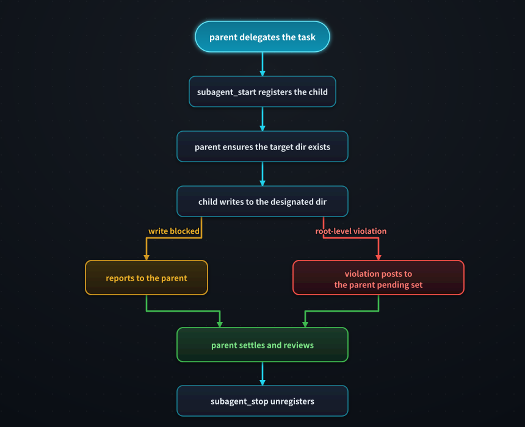



# dir-whip

[](https://opensource.org/licenses/MIT)
[](https://github.com/shawVV1992/dir-whip)

[中文版](./README-zh.md) | [English](./README.md)

Every session that produces files risks the same mess: reports, scratch
files, and downloads all land wherever the agent happened to be standing.
**dir-whip** gives every [Hermes-agent](https://github.com/NousResearch/hermes-agent)
conversation one home for its output inside the Working Directory (Initial
Project Directory) — a timestamped Session Directory — enforced in three
layers: a bundled skill teaches the discipline, the plugin blocks violations
before they land with 9 hooks, and the audit layer catches what slips
through.

**Note:** dir-whip enforces the Working Directory (Initial Project
Directory) only. Writes outside it are allowed + logged (`external-write`);
when an active Hermes project covers the agent CWD, only the session-start
reminder is skipped — in-Working-Directory interception still applies.

[Core Capabilities](#core-capabilities) ·
[Installation & Quick Start](#installation--quick-start) ·
[How It Works](#how-it-works) · [Commands](#commands) ·
[See It In Action](#see-it-in-action) · [Advanced Usage](#advanced-usage) ·
[Security & Risk](#security--risk) · [License](#license)

## Core Capabilities

1. **Teach and enforce combined.** The skill teaches discipline, the plugin
   enforces it — reliable workspace management, no more file chaos.
2. **Dual-layer detection + backstop tools.** The front layer blocks,
   before they land, writes outside the allowlist and Session Directories
   (root-level files and non-session subdirectories alike) with a fix-it
   message; the audit layer snapshot-diffs allowed terminal commands to
   catch what slips past — with same-turn self-heal (`dir_whip_settle`)
   and a dir-whip continuation nudge.
3. **Observable.** 7 `dir-whip:*` bus events, plus one stats.jsonl line
   per verdict (5 MB rollover), for audit and diagnostics.
4. **Scheduled governance.** Pure audit + two-state wake
   (`{"wakeAgent": bool, "violations": N}`) for cron tasks — zero
   auto-delete anywhere; a silent tick never interrupts, violations wake
   the agent to remediate.
5. **Subagent discipline.** Children write to parent-designated
   directories; they never self-create Session Directories.
6. **Project-mode aware.** When an active Hermes project contains the
   agent CWD, the session-start reminder is skipped entirely
   (`skipped-project`).

## Installation & Quick Start

### Prerequisites

- Hermes 0.20.0 or higher.
- Network access to GitHub for the install command.

### Quick Start

```bash
# 1. Install the plugin plus the bundled skill, scripts, and config template
hermes plugins install shawVV1992/dir-whip/dir-whip --enable

# 2. Restart Hermes — the plugin activates on the next session

# 3. Verify the effective configuration and its source
/dir-whip
```

Expect `State: enabled` — see [See It In Action](#see-it-in-action) for a
full sample report.

The plugin becomes active after the next Hermes restart. No installer script
and no separate skill install are needed.

### Update

```bash
hermes plugins install shawVV1992/dir-whip/dir-whip --force
```

`dir-whip-config.yaml` is preserved across reinstalls.

### Uninstall

```bash
hermes plugins remove dir-whip
```

### Enable / Disable

```bash
# On
hermes plugins enable dir-whip

# Off
hermes plugins disable dir-whip
```

## How It Works

### Design Principles

- **Teach and enforce separately** — the skill and the plugin share zero
  runtime coupling; they only share one config file and one verdict rule set.
- **Allow false passes, never false blocks** — the front layer is deliberately
  permissive; the audit layer is the reliable backbone.
- **Observe facts, not intent** — the audit layer diffs what actually landed
  on disk instead of parsing command strings.

### Architecture



| Layer | Role | Form |
|-------|------|------|
| **Config** (`dir-whip-config.yaml`) | Sole configuration source; Skill and Plugin have zero runtime coupling and meet only at this file (teach / enforce split) | `allowlist` files/dirs + `working_dir_root` keys; hand-edited or row-level edited via `/dir-whip` |
| **Skill (teaches, incl. Scripts tools)** | Discipline reference + CLI helpers | Bundled `workspace-organization` skill (opt-in) + one conditional session-start reminder (≤280 chars, injected only when the agent CWD is inside the Working Directory and no active project covers it); scripts `create_session_dir.py` / `audit_workspace.py` / `workspace_resolver.py` (create · audit · resolve) |
| **Plugin (enforces)** | Intercepts violations before they land and handles the backstop | 9 hooks in three groups (as drawn): **front-layer interception** (`pre_tool_call` pre-landing three-tier verdict), **audit-layer backstop** (snapshot diff + L1 notice + L3 gate), **backstop tools** (`dir_whip_allow_path` / `dir_whip_settle` / `/dir-whip`); plus the `pre_verify` continuation nudge and observe-only hooks |
| **Observability** | Records and reports | stats.jsonl (5 MB rollover) + 7 `dir-whip:*` events + dir-whip.log + the `/dir-whip` merged report |

Every Hermes conversation that produces files gets one Session Directory at
the Working Directory root:

```
<Working Directory>/
├── (strict empty allowlist; add via /dir-whip allow)
└── 20260822_143000_ReportTask/    # Session Directory (lazy-created)
    ├── Outputs/                   # formal deliverables
    └── .tmp/                      # intermediate files (age-listed, never auto-cleaned)
```

- Named `YYYYMMDD_HHMMSS_TaskName/` with a real timestamp (the plugin
  validates it).
- Created lazily at the first file write — conversations that produce no
  files create no directory.
- The root allows exactly three things: allowlist `files` entries, the
  top-level directories behind `dirs` entries, and session-format
  directories. (The audit quarantine lives in the
  dir-whip home: `<profile home>/dir-whip/audit-quarantine/`.)

### Enforcement

The runtime flow is built on the four-level audit ladder of spec §5.18:

| Level | Name | Mechanism & surface |
|-------|------|---------------------|
| **L1** | teach | The fire-once notice — the only non-blocking, fire-once in-conversation notice naming violations and remedies (`transform_tool_result` hook, enters the conversation exactly once; the L3 gate message and the `pre_verify` nudge name them too, but only by blocking or continuing the turn) |
| **L2** | record | `write-audit-violation` / `write-audit-gate-block` stats rows and bus events — background observability only, never in the conversation, never blocking |
| **L3** | gate | The unresolved-violation latch — freezes all write-class calls until settlement completes |
| **L4** | remediate | Remedies and fallback — `dir_whip_settle` / move into a Session Directory / user `/dir-whip allow` / out-of-band removal |



`write_file` / `patch` are judged by target path; terminal commands are
lexically tiered at the shell level. Two layers, two responsibilities — the
front layer owns pre-landing, the audit layer owns post-landing:

**Front layer (interception, permissive and fast)** — designed on **allow
false passes, never false blocks**:

- Only three write-class tools are judged: `write_file` / `patch` /
  `terminal`; other tools and read-only commands never enter the chain.
- **Three-tier verdict**: deterministic targets (tool paths, terminal
  redirects / `touch` / `cp`·`mv` destinations / resolvable `mkdir`,
  `curl -o` and `wget -O` targets — rule_keys `terminal-mkdir` /
  `terminal-download`) enter the unified classify chain; uncertain write
  intent (heredoc, interpreter-led segments, nested shells, `$`/backtick
  variables) is allowed + logged; device paths and read-only commands are
  silently exempt.
- **Chain-aware extraction**: command chains split on `&&` / `;` / `|` /
  newlines, targets extracted per segment; `=`-leading redirect targets
  excluded (redirect slots only — the `touch` / `mkdir` / `cp·mv`
  literal-argument shapes do not filter them).
- **Unified classify chain** (shared with the audit layer — the two can
  never disagree), scope-first T0-T4:

| Tier | Scope judged | Verdict | Notes |
|------|--------------|---------|-------|
| **T0** | Outside the Working Directory | allowed + logged (`external-write`) | Scope-first: outside-root is ALWAYS `external-write` — an allowlist entry can no longer mask it |
| **T1** | Runtime allowlist (on-the-spot grant) | allowed | |
| **T2** | Config allowlist (`dirs` subtree / root-level `files` entry) | allowed | |
| **T3** | Session Directory | allowed | |
| **T4** | Everything else (incl. the Working Directory root itself) | block (`root-file` / `non-session-dir`) | Fix-it guidance in the message |

One Session Directory per conversation: the first creation binds the
conversation to that directory, and a second creation attempt is blocked
(`session-dir-limit`); writes into already-existing Session Directories and
user `allow_path` registrations stay exempt.

**Audit layer (backstop, four-level ladder)** — observes only what allowed
terminal commands actually landed:

- **Snapshot diff**: pre/post root snapshots for allowed terminal commands
  only; root-level **file** entries only — directory changes never violate,
  deletions are record-only.
- **Pending set**: session-scoped; subagent violations post to the parent's
  set — the parent settles the latch.
- The four-level ladder (defined in the table above), as it surfaces in
  the audit layer:

| Level | Audit-layer behavior |
|-------|----------------------|
| **L1** | The fire-once notice is the only non-blocking in-conversation prompt |
| **L2** | Stats + events stay in the background |
| **L3** | The latch freezes every write-class call (incl. `rm` and agent-driven config edits) |
| **L4** | Four remedies — settle / move into a session dir (out-of-band) / user `/dir-whip allow` / out-of-band removal |

- **Settlement is config-only**: a runtime exemption is prospective-only
  and never clears a recorded violation.
- **pre_verify continuation nudge**: one more reminder when a turn ends
  with unresolved violations, capped at 3 per session.

> **Notes**
>
> - While latched, *every* write-class call is frozen — incl. `rm` and
>   agent-driven config edits; nothing but remediation clears it in-session
>   (`dir_whip_settle` / move into a Session Directory / user allow /
>   out-of-band removal).
> - A runtime exemption does **not** clear a recorded violation; the latch
>   is session-scoped — once the file leaves the root, writes pass again.

### Session-Start Orphan Scan

At every top-level session start (after the reminder injection), the plugin
scans the Working Directory root for **orphans** — entries left outside any
Session Directory by a previous conversation:

- **Judged by the same classify chain**: every root entry passes through
  `classify_target`; a T4 verdict (`root-file` / `non-session-dir`) marks
  an orphan candidate, while T0–T3 targets (outside the root, runtime
  allowlist, config allowlist, compliant Session Directories) are
  auto-exempt.
- **Advise-only**: the scan never blocks and never deletes. Orphans are
  reported once, as an in-conversation notice:
  `NOTICE: Working Directory root has entries outside a session directory:`
  followed by per-entry guidance — create a session directory (the same
  `create_session_dir.py` line) then relocate the entry
  (`mv "<root>/<entry>" "<session_dir>/Outputs/"`).
- **Fail-open**: any scan error is silently skipped; recorded in stats as
  the `orphan-notice` rule_key, with no bus event (the 7-event emit
  surface is unchanged).

## Commands

### Command List

| Command | Action | Example | Notes |
| ------- | ------ | ------- | ----- |
| `/dir-whip` | Print the merged report (fields under "Report Fields") | `/dir-whip` | |
| `/dir-whip list` | Show the current allowlist (two-section numbered listing) | `/dir-whip list` | Files section first, Dirs second, one continuous numbering (the numbers used by allow / remove); ends with a `Quarantine:` line (the audit-quarantine path) |
| `/dir-whip allow` | Enumerate allowlist candidates (two-section numbered listing + Add hint) | `/dir-whip allow` | numbering same as `list` |
| `/dir-whip allow <number\|name\|path>` | Register entries into the allowlist, batch via commas or whitespace; existing paths are classified disk-aware (directory → `dirs`, file → `files`), non-existent paths follow a confirm-create protocol | `/dir-whip allow notes.txt` · `/dir-whip allow projects/foo` · `/dir-whip allow 1,3` · `/dir-whip allow docs/ --create` | paths accept relative or absolute input; outside-root / root-itself inputs are rejected with guidance; an existing file inside a subdirectory is rejected outright (a `files` entry can only be a root-level file); `--create` decides the artifact by form: trailing slash or nested path → directory, bare name → root-level file |
| `/dir-whip remove` | Enumerate the allowlist's current entries (two-section numbered listing + Remove hint) | `/dir-whip remove` | numbering same as `list` |
| `/dir-whip remove <number\|name>` | Remove entries from the allowlist; matched by name with no disk discrimination (a hand-edited double entry is removed from both sets) | `/dir-whip remove 2` · `/dir-whip remove notes.txt` | numbers are the continuous two-section numbering |

### Report Fields

`/dir-whip` prints one merged report:

| Field | Meaning |
| ----- | ------- |
| `[dir-whip] v<version>` | Plugin version from plugin.yaml (`unknown` if unreadable) |
| `State` | `enabled`, or `disabled` when the Working Directory could not be resolved (fail-open; the guard is off) |
| `Working Directory` | Value + resolving source (see next row); `(unresolved)` when none |
| source | `guard-config` (dir-whip-config.yaml) · `profile-config` (profile `terminal.cwd`) · `fail-open` |
| `Allowlist` | Multi-line block: a header line plus one indented `Files:` / `Dirs:` line each; the single line `Allowlist: (strict empty allowlist)` when there is no entry at all; an ignored legacy flat value adds an indented count line |
| `WARNING` | Anomaly-only: the `working_dir_root` override differs from the profile `terminal.cwd` |
| `Stats File` | Absolute path to stats.jsonl |
| `Debug Log` | Absolute path to dir-whip.log, suffixed `(no records yet)` or `(unavailable)` |
| `Health` | `Good`, or `N issue(s)` with one indented line per issue (resolution FAIL-OPEN, stats.jsonl not writable) |

## See It In Action

Plugin messages below are quoted verbatim from the source; only paths are
abbreviated.

### 1. The front layer blocks a root-level write

```text
You:   Summarize today's standup and save it as notes.txt.

Agent: echo "Standup notes ..." > notes.txt        # root-level write

BLOCKED: File writes in the Working Directory require a Session Directory or an allowed root file.
Target: notes.txt
Fix: Create a session directory first:
  python <plugin>/skills/workspace-organization/scripts/create_session_dir.py <task_name> --workspace <Working Directory>
Then write the deliverable to Outputs/<filename> (or scratch to .tmp/<filename>).
User-specified path -> dir_whip_allow_path first.
One session directory per conversation.
mv "<Working Directory>/<first-segment>" "<session_dir>/Outputs/"    # only appended when the target's first path segment already exists as a non-compliant directory
If this is a project directory, add it to the allowlist dirs in HERMES_HOME/dir-whip/dir-whip-config.yaml (relative to the Working Directory root, e.g. projects/foo)
Reply using the [Reason]/[Next] template.

Agent: python .../scripts/create_session_dir.py StandupNotes --workspace <WD>
       # creates 20260827_100000_StandupNotes/
Agent: .../20260827_100000_StandupNotes/Outputs/notes.txt   # lands cleanly
```

### 2. The audit layer catches what slips through — and self-heals

```text
Agent: (a write slips past the front layer and lands at the root)

[dir-whip] Write audit: the following file(s) were written to the Working Directory root outside any Session Directory:
  - notes.txt
Remediate now: call dir_whip_settle(paths=["notes.txt"]) to move the file(s) into quarantine (<profile home>/dir-whip/audit-quarantine/), or move them manually into a Session Directory (YYYYMMDD_HHMMSS_TaskName/Outputs|.tmp/). To keep the file(s) at the root, ask the user to add them to the allowlist files entries in dir-whip-config.yaml (files: [notes.txt]) — give them the exact command to run: /dir-whip allow <path> — while the block is active all writes are frozen (config edits included). Further writes to the Working Directory are blocked until then.

Agent: dir_whip_settle(paths=["notes.txt"])
       # file moves to <profile home>/dir-whip/audit-quarantine/<timestamp>/, gate re-opens
```

### 3. `/dir-whip` reports the live state

```text
/dir-whip

[dir-whip] v0.6.5
State: enabled
Working Directory: E:/HermesWorkspace/default  (source: guard-config)
Allowlist:
  Files: README.md
  Dirs: projects/foo
Stats File: C:/Users/me/AppData/Local/hermes/dir-whip/stats.jsonl
Debug Log: C:/Users/me/AppData/Local/hermes/dir-whip/dir-whip.log
Health: Good
```

## Advanced Usage

### Config

Optional and user-managed, at `HERMES_HOME/dir-whip/dir-whip-config.yaml`
(`HERMES_HOME` wins; Windows default `%LOCALAPPDATA%/hermes`, falling back
to `~/hermes` when unset; POSIX default `~/.hermes`). With session profiles
it lives at `profiles/<name>/dir-whip/`.

| Field | Meaning |
| ----- | ------- |
| `allowlist.files` | Root-level file basenames allowlist (e.g. `README.md`); name validation rejects `..`, absolute forms and path separators |
| `allowlist.dirs` | Working-Directory-relative dir paths (e.g. `projects/foo`), **recursive subtree exemption**, multi-level allowed |
| `allowlist` key missing | Strict empty fallback — the allowlist is empty and every root-level write is blocked |
| `working_dir_root` | Explicit Working Directory override; `/dir-whip` prints a WARNING when it differs from the profile `terminal.cwd` |

```yaml
allowlist:
  files: []   # root-level file basenames, e.g. ["README.md", "notes.txt"]
  dirs: []    # relative dir paths, recursive subtree, e.g. ["projects/foo"]
# working_dir_root: E:/HermesWorkspace/default   # optional override
```

**Parsing mechanism.** One resolution chain each for the plugin and the
scripts (node details in the notes below):

**Plugin side** (parsed once at register · refreshed at each top-level
session start):



- Safe YAML parsing (`safe_load`): a missing or unparseable file falls
  back to an empty config (strict empty allowlist) while Working
  Directory resolution continues through the profile `terminal.cwd` —
  the guard stays enabled; only when the whole resolution chain fails
  does the guard turn off (`State: disabled`, Health lists the issues).
  A `/dir-whip` WARNING prints when the override differs from the
  profile `terminal.cwd`.

**Script side** (standalone · line-parse fallback when no yaml library):



- Candidate roots = all profile cwds + `TERMINAL_CWD` (`--workspace` matches
  equal, CWD matches containment); on a miss interactive mode falls back to
  CWD with a stderr WARNING while `--workspace` mode stays clean and the
  caller exits 2; the two chains are verdict-equivalent (parity-tested) —
  the guard and the scripts never disagree.

### Cron Support

`audit_workspace.py` is the scheduled-governance entry for Hermes cron
jobs: `--gate` runs a pure audit and appends one JSON wake line to
stdout. Exit codes: 0 compliant, 1 violations found, 2 parameter error
or an unresolved Working Directory (cron failure visibility).

- **Pure audit + two-state wake** — the final stdout line is
  `{"wakeAgent": bool, "violations": N}`, exactly two keys. `false` is
  a silent tick (no interruption); `true` wakes the agent to remediate.
- **Zero auto-delete** — the plugin never deletes anything; cleanup
  decisions belong to the agent.
- **Read-only inventory** — the interactive audit lists expired `.tmp`
  entries as a proposal
  ("Expired .tmp entries (proposal only; cleanup needs your
  confirmation):"), ready for the agent (or the user) to act on.

```bash
# cron job example: audit the Working Directory, wake only on violations
python <plugin>/skills/workspace-organization/scripts/audit_workspace.py --gate
```

### Subagent Mode

When a parent agent delegates to subagents, it follows this mechanism:



- `subagent_start` registers the child→parent mapping: the child's
  session-start reminder is recorded as `skipped-child`, and the audit state
  is inherited from the parent (the latch is not reset).
- The parent ensures the target directory exists before delegating (creating
  a Session Directory first when needed); the parent session's `.tmp/` by
  default, or an explicit `Outputs/` path / per-subagent subdirectory
  (e.g. `.tmp/<task>/`).
- Verdicts for subagent writes are identical to the parent's; stats are
  split by `is_subagent`.
- Subagent violations post to the **parent pending set** —
  `dir_whip_allow_path` and `dir_whip_settle` are rejected for subagents;
  exemptions and settlement are the parent's job.
- When the target directory is missing or a write is blocked, the child
  reports to the parent instead of creating a Session Directory itself.
- `subagent_stop` unregisters the child and records duration/status; the
  `.tmp/` → `Outputs/` promotion is the parent's review step.

### Statistics & Observability

Every verdict is appended as one JSON line to
`HERMES_HOME/dir-whip/stats.jsonl` (rolls over to `stats.jsonl.1` at 5 MB).
Recorded: interception verdicts, runtime exemptions, approval observations,
and the write audit's violations and gate blocks
(`write-audit-violation` / `write-audit-gate-block`), split by subagent;
observe-only rows (`session-reminder`, `orphan-notice`, `pre-verify-nudge`,
`write-audit-settle` / `-rejected`, `subagent-start` / `subagent-stop`,
`pre-command:*`) are recorded alongside.
Each line carries two groups of fields:

| Field | Meaning | Notes |
| ---- | ---- | ---- |
| `profile` | Session profile | The stats file lives in that profile's dir-whip directory; the path follows the session profile |
| `session_id` | Session identifier | The session the verdict belongs to |
| `is_subagent` | Subagent flag | Stats are split parent/subagent |
| `started_at` | Session start time | Part of the session context |
| `ts` | Event timestamp | ISO format, moment of the verdict |
| `outcome` | Verdict outcome | `block` / `allow` / `external-write` / `fail-open`, etc. |
| `reason` | Outcome reason | Short phrase, e.g. `target outside working_dir_root` for out-of-root writes |
| `tool` | Triggering tool | `write_file` / `patch` / `terminal` / `allow-path`, etc. |
| `rule_key` | Verdict rule key | e.g. `root-file` / `non-session-dir` / `session-dir` / `runtime-allowlist` / `external-write` / `terminal-mkdir` / `terminal-download` / `session-dir-limit` / `orphan-notice` / `write-audit-violation` / `write-audit-gate-block` / `allow-path-external-rejected` |
| `target` | Target path | Always relative to the Working Directory; external paths are hashed or omitted |

The file never contains file contents or absolute paths, and verdict rows
carry no free text. Observe-only rows are the one exception: `pre-command`
and subagent lifecycle rows record host-provided fields (raw command
arguments, child role/goal) verbatim in the `reason` field.
Observability surfaces:

- **Live event stream** — verdicts and audit results fan out as the 7
  `dir-whip:*` events on the Hermes event bus; subscribe to observe:
  `blocked` / `external-write` / `allowlisted` / `approval-requested` /
  `approval-resolved` / `write-audit-violation` /
  `write-audit-gate-block`. (`approval-requested` fires only when the
  host approval payload carries `request`/`entry` fields, which current
  hermes-agent payloads do not — in practice it stays silent.)
- **`/dir-whip` report** — the Stats File path (cross-session totals),
  Health (stats health), and Debug Log (config source checks).
- **Log levels** — `block` / fail-open log at WARNING, `external-write` at
  INFO, other allows at DEBUG (dir-whip.log).

## Security & Risk

dir-whip is **behavioral monitoring and soft management**, **not a security
boundary**: it observes and corrects file behavior through the host tool
layer and cannot defend channels that bypass that layer (such as file I/O
inside a code-execution kernel).

**Enforced.**

1. **Write-class interception** — in `write_file` / `patch` / `terminal`,
   writes inside the Working Directory but outside the allowlist and
   Session Directories are blocked before they land (root-level files and
   non-session subdirectories alike; `root-file` / `non-session-dir`), with
   fix-it guidance in the message.
2. **Post-hoc root-file audit + settlement gate** — allowed terminal
   commands are re-checked via snapshot diff; slipped-through violations
   run the L1–L4 ladder until settled (see Enforcement).
3. **Session Directory structure compliance** — `audit_workspace.py`
   checks the Outputs/ and .tmp/ layout and lists expired `.tmp` entries
   as a read-only proposal (the cron governance entry — zero auto-delete).

**Not enforced.**

1. **Arbitrary code execution** — file I/O inside an execution kernel
   (`execute_code` and similar) bypasses the guard, the audit, and the gate
   entirely; this is the largest blind spot.
2. **Uncertain write intent** — interpreter scripts, nested shells, variable
   paths, heredoc: allowed + logged; may slip through (the audit is the
   backstop).
3. **Allowlists and exemptions** — `allowlist` files / dirs, the runtime
   allowlist, and writes inside Session Directories: always allowed.
4. **Everything outside the Working Directory** — allowed + logged.
5. **Read-only tools and commands** — never enter the chain.
6. **Deletions** — record-only, never a violation.

**What can go wrong:**

- **Prompt injection** — the agent may be talked into writing anywhere, and
  the landing spot is not controllable. A hidden line in a web page or
  document it was asked to read ("save the result to ~/xxx") is enough:
  targets outside the Working Directory are allowed by design, leaving only
  the log for after-the-fact tracing.
- **Weakened defenses** — widening `allowlist` dirs or disabling the plugin
  leaves the workspace unmanaged. `allowlist` dirs is a recursive subtree
  exemption — one extra registered directory puts the whole subtree outside
  the discipline; `hermes plugins disable dir-whip` turns off all
  interception and auditing with one command.
- **Misconfiguration** — not always visible at a glance. A typo in an
  allowlist filename silently fails to exempt the file and shows up as a
  puzzling block; edits to the wrong profile's `dir-whip-config.yaml` never
  take effect. These hide in the behavior — hard to locate without reading
  the `/dir-whip` report.

**Built-in protections:**

- **Pre-landing interception** — enforcement happens in the `pre_tool_call`
  hook, before a write lands: violating targets are stopped with fix-it
  guidance before execution, so no dirty file is created and there is no
  "write first, clean up later" cost.
- **Post-landing backstop** — uncertain-tier commands may still land files
  via scripts; the audit layer snapshot-diffs the root and registers any
  new or modified root-level violation as pending, freezing every write
  until settlement completes.
- **No silent failures** — a config anomaly (e.g. an unresolvable Working
  Directory) fails open but also injects a WARNING instead of quietly doing
  nothing; when the boundary cannot be verified (`--workspace` mismatch or
  a failed root resolution) the gate refuses to wake the agent.
- **Minimal capability surface** — external writes are allowed but logged
  for after-the-fact auditing; `dir_whip_settle` accepts only paths in the
  current pending set, all-or-nothing, so even a manipulated agent has no
  arbitrary file-moving ability.
- **Verifiable** — every verdict appends one line to stats.jsonl
  (privacy-trimmed: no file contents, no absolute paths); `/dir-whip`'s
  Health and the Debug Log expose config source and stats health at any
  time.

## License

[MIT](./LICENSE) — see the [LICENSE](./LICENSE) file. No third-party
components are bundled.
