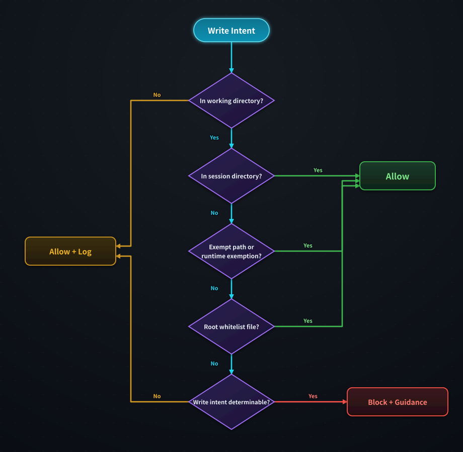
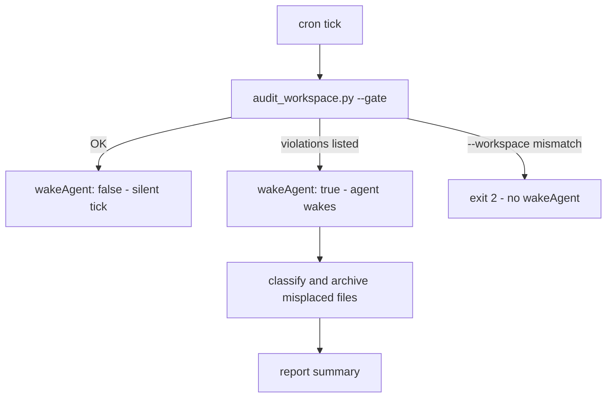
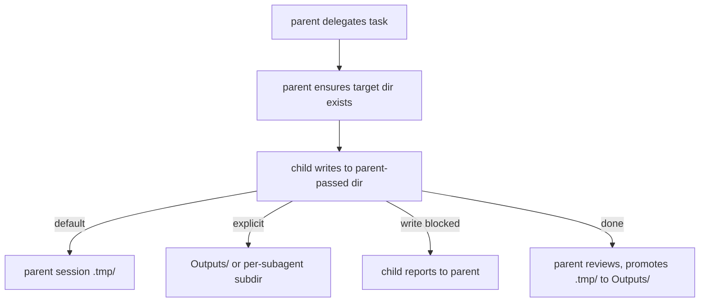



# dir-whip

[](https://opensource.org/licenses/MIT)
[](https://github.com/shawVV1992/dir-whip)

[中文版](./README-zh.md) | [English](./README.md)

dir-whip provides three-layer Working Directory (Initial Project Directory)
file discipline for [Hermes-agent](https://github.com/NousResearch/hermes-agent): the skill teaches rules, the plugin blocks violations with 9 hooks, and the audit layer catches what slips through. 

**Note:** dir-whip only applies to the Working Directory (Initial Project
Directory). Writes outside the Working Directory and newly created project
directories are not subject to enforcement.

[Core Capabilities](#core-capabilities) ·
[Installation & Quick Start](#installation--quick-start) ·
[Architecture & Boundaries](#architecture--boundaries) · [Commands](#commands) ·
[Advanced Usage](#advanced-usage) · [Security & Risk](#security--risk) ·
[License](#license)

## Core Capabilities

1. **Teach and enforce combined.** The skill teaches discipline, the plugin
   enforces it — reliable workspace management, no more file chaos.
2. **Plugin dual-layer detection.** The front layer intercepts root-level
   violations with a fix-it message; the audit layer catches what slips
   past via snapshot diff — with same-turn self-heal (`dir_whip_settle`)
   and a `pre_verify` continuation fallback.
3. **Observable.** 7 `dir-whip:*` events recorded to stats.jsonl
   (5 MB rollover) for audit and diagnostics.
4. **Scheduled governance.** wakeAgent / [SILENT] pattern for cron tasks
   — no interruption to agent execution; next cron tick continues
   governance.
5. **Subagent discipline.** Children write to parent-designated
   directories; they never self-create Session Directories.
6. **Project-mode aware.** When an active Hermes project contains the
   agent CWD, the session-start reminder is skipped entirely
   (`skipped-project`).

## Installation & Quick Start

### Prerequisites

- Hermes 0.20.0 or higher.
- Network access to GitHub for the install command.

### Quick Start

```bash
# 1. Install the plugin plus the bundled skill, scripts, and config template
hermes plugins install shawVV1992/dir-whip/dir-whip --enable

# 2. Restart Hermes — the plugin activates on the next session

# 3. Verify the effective configuration and its source
/dir-whip
```

The plugin becomes active after the next Hermes restart. No installer script
and no separate skill install are needed.

### Update

```bash
hermes plugins install shawVV1992/dir-whip/dir-whip --force
```

`dir-whip-config.yaml` is preserved across reinstalls.

### Uninstall

```bash
hermes plugins remove dir-whip
```

### Enable / Disable

```bash
# On
hermes plugins enable dir-whip

# Off
hermes plugins disable dir-whip
```

## Architecture & Boundaries

### Design Principles

- **Teach and enforce separately** — the skill and the plugin share zero
  runtime coupling; they only share one config file and one verdict rule set.
- **Allow false passes, never false blocks** — the front layer is deliberately
  permissive; the audit layer is the reliable backbone.
- **Observe facts, not intent** — the audit layer diffs what actually landed
  on disk instead of parsing command strings.

### Architecture

| Layer | Role | Form |
|-------|------|------|
| **Skill (teaches)** | Discipline reference | Bundled `workspace-organization` skill (opt-in) + one conditional session-start reminder (≤280 chars, injected only when the agent CWD is inside the Working Directory and no active project covers it) |
| **Plugin (enforces)** | Blocks violations before they land | 9 hooks: `pre_tool_call` interception + write audit + session/subagent observation + `pre_verify` continuation fallback |
| **Scripts (tools)** | CLI helpers for agents and cron | `create_session_dir.py` / `audit_workspace.py` / `workspace_resolver.py` |
| **Config** | Sole configuration source | `dir-whip-config.yaml` |
| **Observability** | Records and reports | stats.jsonl + `dir-whip:*` events + `/dir-whip` |

Every Hermes conversation that produces files gets one Session Directory at
the Working Directory root:

```
<Working Directory>/
├── (strict empty allowlist; add via /dir-whip allow)
├── 20260822_143000_ReportTask/    # Session Directory (lazy-created)
│   ├── Outputs/                   # formal deliverables
│   └── .tmp/                      # intermediate files (age-cleanable)
└── .hermes/                       # Hermes internal
```

- Named `YYYYMMDD_HHMMSS_TaskName/` with a real timestamp (the plugin
  validates it).
- Created lazily at the first file write — conversations that produce no
  files create no directory.
- The root allows exactly three things: allowlist `files` entries,
  session-format directories, and `.hermes/`.

### Enforcement

Terminal writes are intercepted at the shell level: redirects (`>` `>>` `1>`
`2>`), `touch`, and `cp`/`mv` destinations. Two layers enforce the
discipline:



**Front layer** (permissive, fast) — chain-aware extraction splits on `&&` /
`;` / `|` / newlines and extracts targets only within each command segment.
Redirect targets starting with `=` are excluded. Device paths (`/dev/null`,
`/dev/stdout`, `/dev/stderr`) are exempt before normalization. Commands
containing `<<` (heredoc) are blanket-demoted to the allow+log tier without
parsing the body. This layer is designed to never block legitimate commands.

**Audit layer** (reliable backbone) — a pre/post snapshot diff of root
entries catches any file the front layer let through. When a violation is
detected, the L1 notice names the file and the remediation — including the
`dir_whip_settle` self-heal tool, which moves flagged files into the audit
quarantine and re-opens the gate within the same turn; the L3 gate freezes all
further write-class tool calls until the file is moved or removed.

> **Gate notes (verified on a live host).** While the gate is latched,
> *every* write-class call is frozen — including `rm`, so in-session
> deletion cannot clear it. Sanctioned ways out: call `dir_whip_settle`
> (moves the file into `.hermes/audit-quarantine/`), move the file into a
> Session Directory, register it in `allowlist` (`files` / `dirs`
> entries), authorize the path via `dir_whip_allow_path`, or
> remove it out-of-band. The latch itself is session-scoped: once the file
> no longer sits at the root, writes pass again. Note also that `AGENTS.md`
> writes are additionally gated by Hermes itself (agent-instruction
> protection) and need interactive approval regardless of dir-whip's verdict.

### Boundaries

| Enforced | Not enforced |
|----------|--------------|
| Root-level non-allowlist writes (`write_file` / `patch` / `terminal`) | Writes inside a Session Directory |
| Post-hoc root write audit + settlement gate | Root allowlist files (`allowlist` `files` entries) |
| Session Directory structure compliance (audit script) | Dirs allowlist (`allowlist` `dirs` entries + runtime allowlist) |
| | Everything outside the Working Directory (allowed + logged) |
| | Read-only tools and commands |
| | Deletions (report-only, never violations) |

## Commands

`/dir-whip` prints one merged report:

| Field | Meaning |
| ----- | ------- |
| `[dir-whip] v<version>` | Plugin version from plugin.yaml (`unknown` if unreadable) |
| `State` | `ACTIVE`, or `FAIL-OPEN` when the Working Directory could not be resolved |
| `Working Directory` | Value + resolving source (see next row) |
| source | `guard-config` (dir-whip-config.yaml) · `profile-config` (profile `terminal.cwd`) · `fail-open` |
| `Terminal Guard` | `enabled` / `disabled` (`terminal_guard`) |
| `Allowlist` | `Files: (none)` or comma-joined root file basenames + `Dirs: (none)` or comma-joined relative dir paths, or `(strict empty allowlist)` if missing (`allowlist`); an ignored legacy flat value appends the count |
| `Reminder` | Session-start discipline-block outcome: `injected` / `skipped-outside` / `skipped-child` / `skipped-project` / `unavailable` (`(not recorded)` before the first session start) |
| `Health` | `OK`, or `PROBLEM` with one line per issue (resolution, stats.jsonl writability) |
| `Stats File` | Absolute path to stats.jsonl |

Subcommands `allow|remove|list` manage the allowlist via `config_writer`
(row-level edit, comments preserved):

| Subcommand | Action | Example |
| ---------- | ------ | ------- |
| `/dir-whip` | Print the merged report (version / State / Allowlist / Reminder / Health) | `/dir-whip` |
| `/dir-whip list` | Show the current allowlist (two-section numbered listing) | `/dir-whip list` |
| `/dir-whip allow` | Enumerate root candidates (two-section numbered listing + Add hint) | `/dir-whip allow` |
| `/dir-whip allow <number\|name\|path>` | Register entries, batch via commas; existing paths are classified disk-aware (directory → `dirs`, file → `files`), non-existent paths follow a confirm-create protocol | `/dir-whip allow notes.txt` · `/dir-whip allow projects/foo` · `/dir-whip allow 1,3` · `/dir-whip allow docs/ --create` |
| `/dir-whip remove` | Enumerate current entries (two-section numbered listing + Remove hint) | `/dir-whip remove` |
| `/dir-whip remove <number\|name>` | Remove entries; matched by name with no disk discrimination (a hand-edited double entry is removed from both sets) | `/dir-whip remove 2` · `/dir-whip remove notes.txt` |

Additional semantics: numbers map into the two-section numbered listing (Files
then Dirs, one continuous sequence); path arguments accept relative or absolute
input — `--create` decides the created artifact by form (trailing slash or
nested path → directory, bare name → root-level file); outside-root/root-itself
inputs are rejected with guidance. Unknown args print
`Usage: /dir-whip [allow|remove|list]`; bare `/dir-whip` without args still
renders the merged report.

`dir_whip_allow_path(path)` is the plugin's eager tool: call it before writing
when the user explicitly names a target path in the conversation. The entry
lasts for the current session only and merges with `allowlist` `dirs`
entries at Tier 0. A second tool, `dir_whip_settle(paths)`, is registered
lazily on the first write-audit notice and moves flagged root files into the
audit quarantine (same-turn self-heal).

## Advanced Usage

### Optional Configuration

Optional and user-managed, at `HERMES_HOME/dir-whip/dir-whip-config.yaml`
(Windows: `%LOCALAPPDATA%/hermes/dir-whip/dir-whip-config.yaml`; POSIX:
`~/.hermes/dir-whip/dir-whip-config.yaml`).

| Key | Meaning |
| --- | ------- |
| `allowlist` | Structured mapping: `files` = root-level file basenames, `dirs` = Working-Directory-relative dir paths (recursive subtree exemption; multi-level allowed); strict empty fallback when the key is missing; legacy flat values are ignored fail-closed |
| `working_dir_root` | Explicit Working Directory override; fallback = profile `terminal.cwd` |
| `terminal_guard` | Enable/disable terminal write interception (default: enabled) |
| `write_audit` | Enable/disable the post-hoc root write audit (default: enabled) |
| `write_audit_entry_cap` | Maximum root entries before the audit skips the round (default: 2000) |

```yaml
allowlist:
  files: []   # root-level file basenames, e.g. ["README.md", "notes.txt"]
  dirs: []    # relative dir paths, recursive subtree, e.g. ["projects/foo"]
# working_dir_root: E:/HermesWorkspace/default   # optional override
# terminal_guard: enabled                        # default when absent
# write_audit: enabled                           # default when absent
# write_audit_entry_cap: 2000                    # default when absent
```

> Configuration lives in `dir-whip-config.yaml` — edit by hand or via
> `/dir-whip allow <number|name|path>|remove|list` (row-level edit via
> config_writer, comments preserved). Bare `/dir-whip` without args is still a
> read-only report.

**Working Directory resolution.** Resolution follows three steps: explicit
`working_dir_root` in dir-whip-config.yaml wins; otherwise the current profile's
`terminal.cwd` is used; if both fail, dir-whip falls back to the current
working directory with a WARNING. `/dir-whip` reports the value
and its source.

### Scheduled Governance

`audit_workspace.py --gate` is a zero-token pre-run gate for Hermes cron
jobs:



```bash
# Cron job: script= scripts/audit_workspace.py --gate
#           skill= dir-whip:workspace-organization
#           prompt: "If audit found violations, classify and archive misplaced
#                    files. If no violations, respond with [SILENT]."
```

- stdout "OK" → `{"wakeAgent": false}` → silent tick, no delivery
- stdout lists violations → `{"wakeAgent": true}` → the agent wakes, classifies,
  and moves files into Session Directories
- `--workspace` mismatch → exit 2, no wakeAgent (a misconfigured boundary is a
  system problem, not a governance situation)

### Subagent Mode

When a parent agent delegates to subagents, it follows this file protocol:



- The parent ensures the target directory exists before delegating (creating
  a Session Directory first when needed).
- The child writes to the parent-passed target directory: the parent session's
  `.tmp/` by default; the parent may explicitly pass an `Outputs/` path (formal
  deliverables) or a per-subagent subdirectory (e.g. `.tmp/<task>/`).
- The child never self-creates a Session Directory and never self-promotes
  (`.tmp/` → `Outputs/` promotion is the parent's review step).
- When the target directory is missing or a write is blocked, the child
  reports to the parent instead of creating a Session Directory itself.
- Verdicts for subagent writes are identical to the parent's; stats are
  split by subagent.

### Statistics

Every verdict is appended as one JSON line to
`HERMES_HOME/dir-whip/stats.jsonl`. Each line carries session fields
(`profile` / `session_id` / `is_subagent` / `started_at`) and event fields
(`ts` / `outcome` / `reason` / `tool` / `rule_key` / `target`). Recorded:
interception verdicts, runtime exemptions, approval observations, and the
write audit's violations and gate blocks (`write-audit-violation` /
`write-audit-gate-block`), split by subagent. `target` is always relative to
the Working Directory; external paths are hashed or omitted — no file
contents, no absolute paths, no prompt text. At 5 MB the file rolls over to
`stats.jsonl.1`; see the Stats File path shown by `/dir-whip` for
cross-session totals.

## Security & Risk

dir-whip is a discipline aid, not a security boundary.

**What can go wrong.** An agent may be prompted to write anywhere; a prompt
injection can push writes to unexpected locations. Widening `allowlist`
(`dirs` entries) or disabling the plugin leaves the workspace unmanaged.
Misconfiguration is not always visible without a check.

**Built-in protections.** Enforcement happens in the `pre_tool_call` hook
before a write lands. Root writes that slip past are caught by the write
audit (post-hoc snapshot diff) and further writes are frozen until the file
is moved or removed. Misconfiguration fails open with a WARNING, never in
silence. External writes are allowed but logged. Stats are privacy-trimmed.
The audit gate refuses to wake agents when `--workspace` mismatches, and
`/dir-whip`'s Health verifies config and stats health.

## License

[MIT](./LICENSE) — see the [LICENSE](./LICENSE) file. No third-party
components are bundled.
